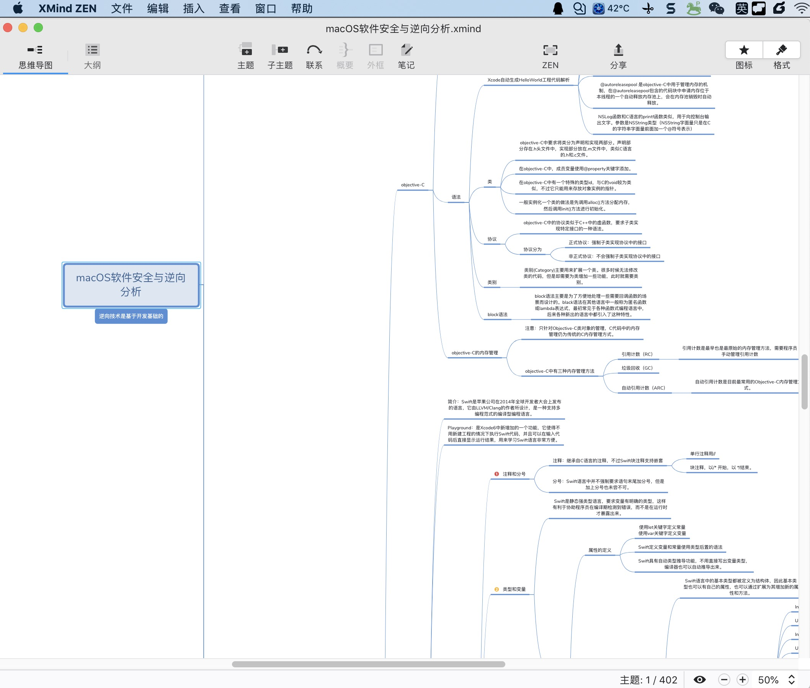
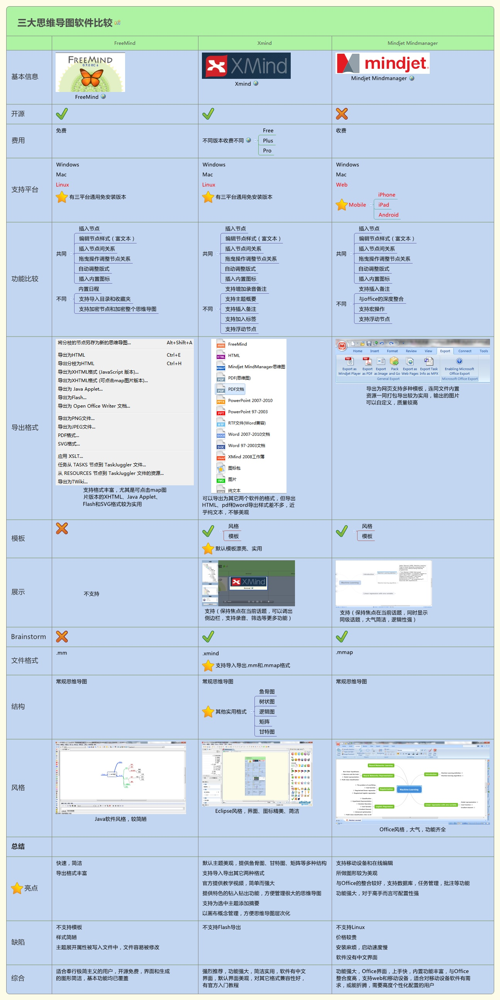
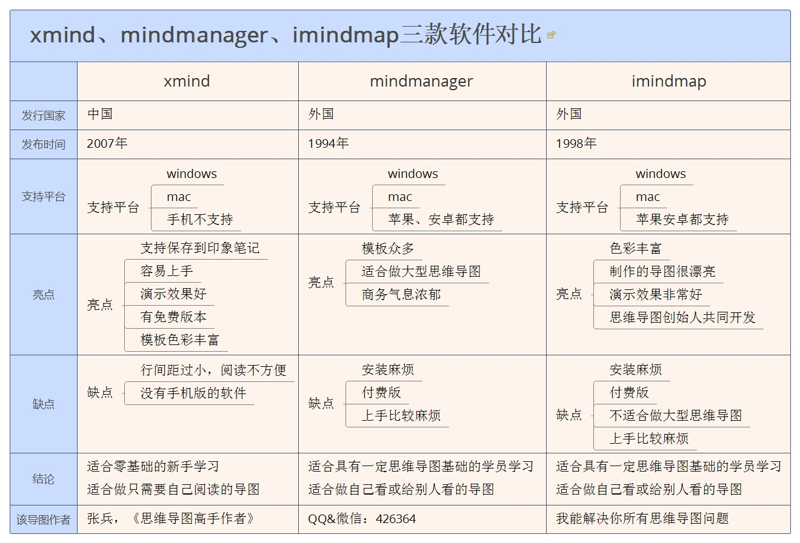
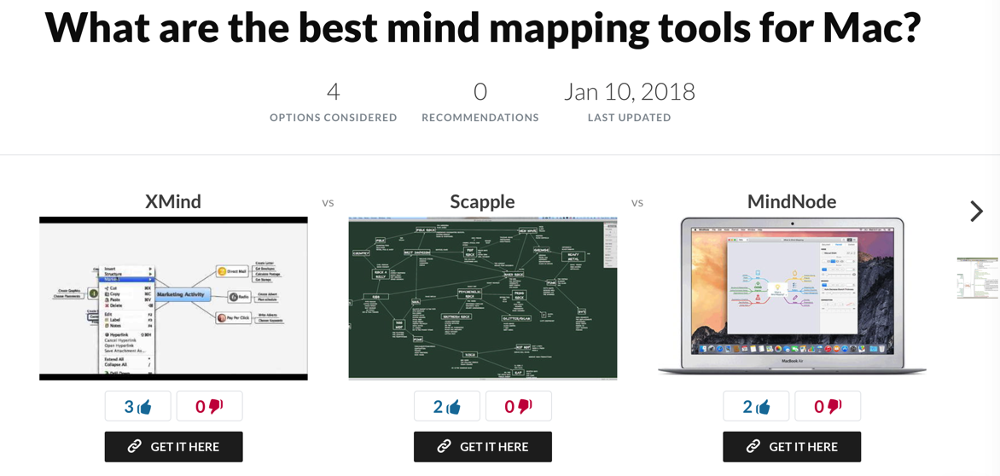

# 脑图mindmap

* `脑图`=`mindmap`=`mind map`
  * 别称：`思维导图`
  * 是什么：常见图形的一种，常用于总结某类内容
    * 往往是公司多人开会头脑风暴讨论某个东西后，用脑图呈现出来，成系统的一套东西
  * 长什么样：从中间某个主题，散发出去，呈现多个分支状
    * Xmind
      * 
    * processon
      * 

## 常见脑图工具

* 客户端软件
  * 跨平台
    * `Xmind`：很好用
    * `MindJet`的`MindManager`
    * `Freemind`：虽然免费，但是真心不好用
    * `iMindMap`：3D，炫酷，好看
      * 
    * `MindMaster`
    * `Omnigraffle`：古老的感觉
  * Mac
    * `MindNote`
    * `Scapple`
    * `MindNode`：Mac端，简洁好用
      * 主页
        * Mind Map & Brainstorm Ideas - MindNode
          * https://www.mindnode.com/
            * 
* 在线网站
  * 推荐：processon
    * 主页：https://www.processon.com/
  * 百度脑图：很一般

### 对比

#### `XMind`、`MindManager`、`iMindMap`

* `MindManager`是Win平台最强大的，`Xmind`次之，`iMindMap`次次之；
  * MindManager非常强大但是主要维护Windows版！
* XMind是macOS平台最好用的，iMindMap次之，MindManager在十万八千里之外；
  * XMind是macOS和Win同步更新 在macOS下是最棒的，在Win下稳定性受人诟病

#### `Freemind` vs `Xmind` vs `MindJet MindManager`

#### `Xmind` vs `MindManager` vs `iMindMap`

#### `XMind` vs `Scapple` vs `MindNote`

#### 其他评价

* 最强大思维导图工具三剑客除了`MindManager`和`XMind`，第三个就是`iMindMap`只是漂亮，其他方面次于xmind或者mindmanager，因为作图漂亮如果做展示用和存档的话这个还是不错的。
* `iThoughtx`和`MindNode`是macOS与iOS平台轻量级里面最好的思维导图工具，（我个人更喜欢MindNode）
  * 不过这两个工具较话题讨论的两个工具是超级轻量化的，尤其MindNode简单至极，但是大道至简，简单正好带来了零门槛入门，并且可以心无旁念专注于思考。
  * 推荐刚入门就从MindNode学起，等完全掌握了思维导图的精髓后再按照上文选择自己的工具

### 结论

* `macOS`：`Xmind`完胜
* `Win`：`MindManager`完胜
* `macOS`＋`Win`双平台通用：`XMind`完胜
