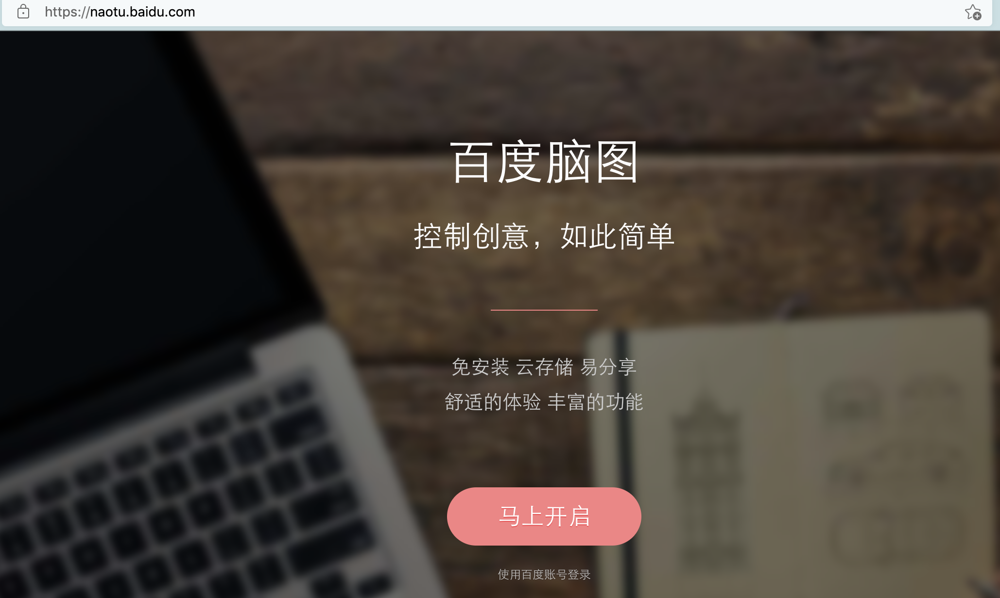
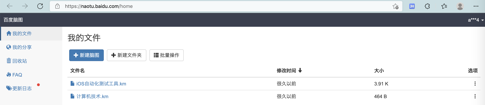
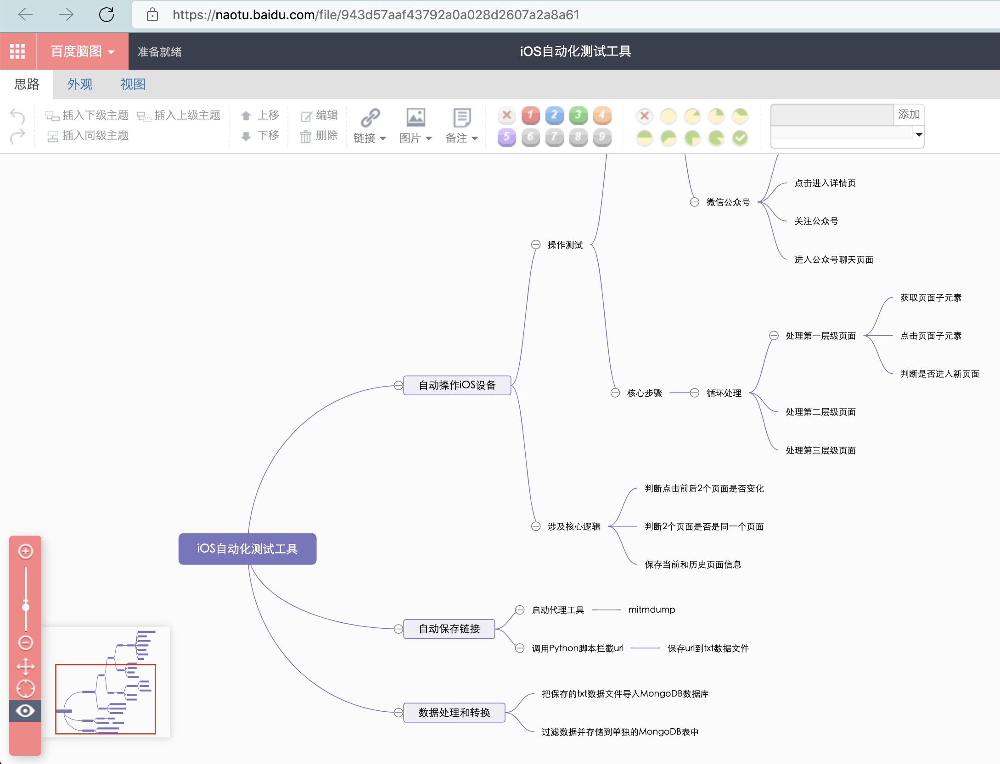
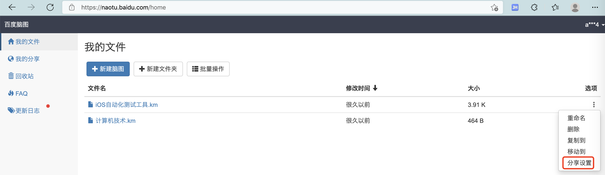
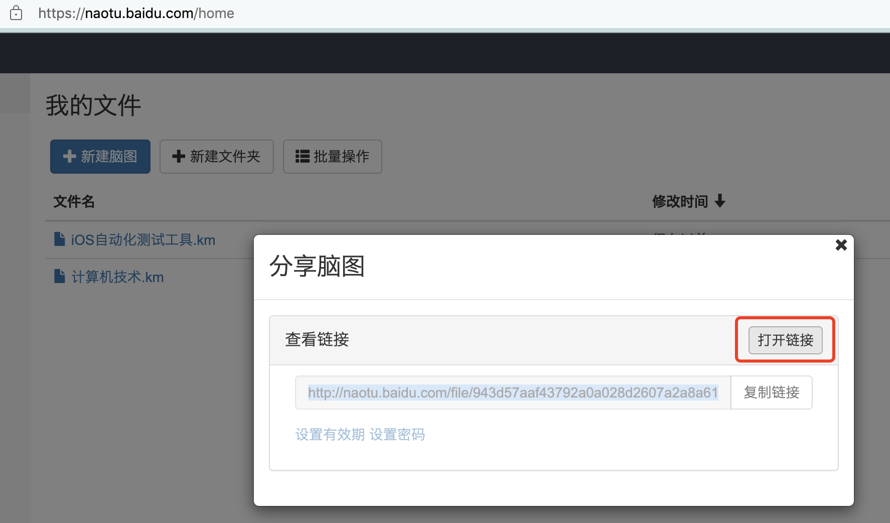
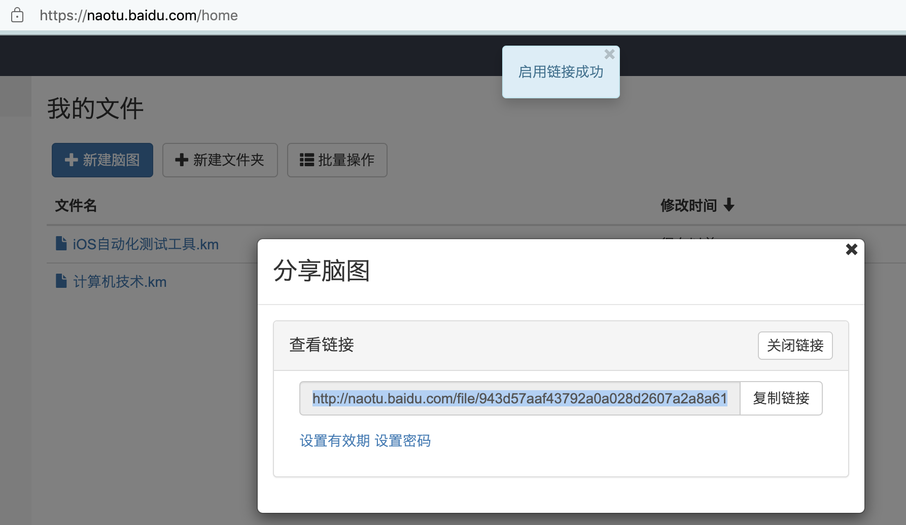
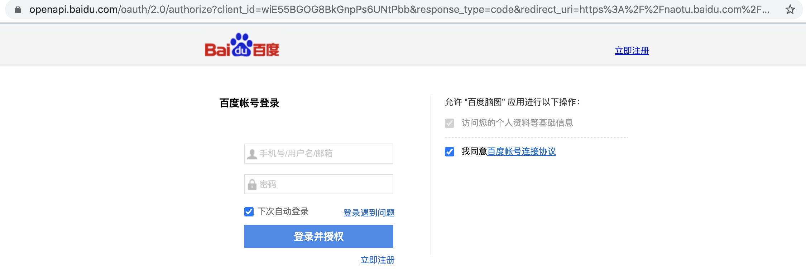

# 百度脑图

此处介绍，在线网站形式去画脑图的工具：`百度脑图`

* 百度脑图
  * 首页
    * 百度脑图 - 便捷的思维工具
      * http://naotu.baidu.com
        * 

## 举例

### iOS自动化测试工具

登录到百度账号后，进入：

https://naotu.baidu.com/home

默认是列表页：

点击对应的脑图，进入编辑页面：

即可去编辑：插入新节点。编辑节点。

## 如何分享

想要分享的话：

要回到列表页：

点击某个脑图右边的 三个点 -> 分享设置：

在弹框 分享脑图 中，点击 `打开链接` = 启动分享 = 别人才能查看

会看到提示：`启用链接成功`

然后去复制出（分享）链接：

http://naotu.baidu.com/file/943d57aaf43792a0a028d2607a2a8a61?token=276f21d452dea5d2

不过，尴尬的是 -》别人要登录 百度账号后，才能查看：

-》非常不方便。放弃使用。
