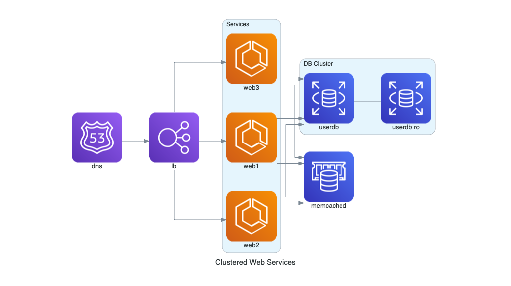
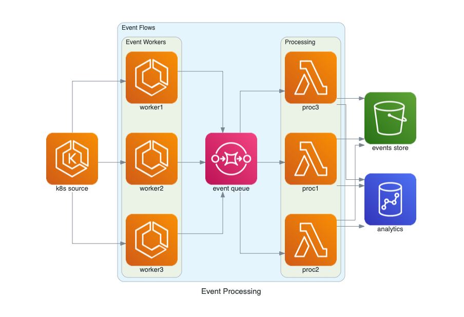
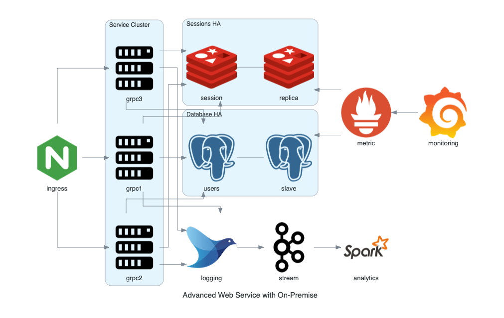

# 云系统架构

此处整理，专门画云系统架构图的工具。

* 画云架构图
  * 用python代码画：`Diagrams`

## `Diagrams`

* `Diagrams`
  * Github
    * mingrammer/diagrams: Diagram as Code for prototyping cloud system architectures
      * https://github.com/mingrammer/diagrams
  * 示例
    * 官网
      * Examples · Diagrams
        * https://diagrams.mingrammer.com/docs/getting-started/examples

## 具体例子

* Grouped Workers on AWS
  * 代码：
    ```python
    from diagrams import Diagram
    from diagrams.aws.compute import EC2
    from diagrams.aws.database import RDS
    from diagrams.aws.network import ELB

    with Diagram("Grouped Workers", show=False, direction="TB"):
        ELB("lb") >> [EC2("worker1"),
                    EC2("worker2"),
                    EC2("worker3"),
                    EC2("worker4"),
                    EC2("worker5")] >> RDS("events")
    ```
  * 效果
    * 
* Clustered Web Services
  * 代码：
    ```python
    from diagrams import Cluster, Diagram
    from diagrams.aws.compute import ECS
    from diagrams.aws.database import ElastiCache, RDS
    from diagrams.aws.network import ELB
    from diagrams.aws.network import Route53

    with Diagram("Clustered Web Services", show=False):
        dns = Route53("dns")
        lb = ELB("lb")

        with Cluster("Services"):
            svc_group = [ECS("web1"),
                        ECS("web2"),
                        ECS("web3")]

        with Cluster("DB Cluster"):
            db_master = RDS("userdb")
            db_master - [RDS("userdb ro")]

        memcached = ElastiCache("memcached")

        dns >> lb >> svc_group
        svc_group >> db_master
        svc_group >> memcached
    ```
  * 效果
    * 
* Event Processing on AWS
  * 代码：
    ```python
    from diagrams import Cluster, Diagram
    from diagrams.aws.compute import ECS, EKS, Lambda
    from diagrams.aws.database import Redshift
    from diagrams.aws.integration import SQS
    from diagrams.aws.storage import S3

    with Diagram("Event Processing", show=False):
        source = EKS("k8s source")

        with Cluster("Event Flows"):
            with Cluster("Event Workers"):
                workers = [ECS("worker1"),
                        ECS("worker2"),
                        ECS("worker3")]

            queue = SQS("event queue")

            with Cluster("Processing"):
                handlers = [Lambda("proc1"),
                            Lambda("proc2"),
                            Lambda("proc3")]

        store = S3("events store")
        dw = Redshift("analytics")

        source >> workers >> queue >> handlers
        handlers >> store
        handlers >> dw
    ```
  * 效果
    * 
* Advanced Web Service with On-Premise
  * 代码：
    ```python
    from diagrams import Cluster, Diagram
    from diagrams.onprem.analytics import Spark
    from diagrams.onprem.compute import Server
    from diagrams.onprem.database import PostgreSQL
    from diagrams.onprem.inmemory import Redis
    from diagrams.onprem.logging import Fluentd
    from diagrams.onprem.monitoring import Grafana, Prometheus
    from diagrams.onprem.network import Nginx
    from diagrams.onprem.queue import Kafka

    with Diagram("Advanced Web Service with On-Premise", show=False):
        ingress = Nginx("ingress")

        metrics = Prometheus("metric")
        metrics << Grafana("monitoring")

        with Cluster("Service Cluster"):
            grpcsvc = [
                Server("grpc1"),
                Server("grpc2"),
                Server("grpc3")]

        with Cluster("Sessions HA"):
            master = Redis("session")
            master - Redis("replica") << metrics
            grpcsvc >> master

        with Cluster("Database HA"):
            master = PostgreSQL("users")
            master - PostgreSQL("slave") << metrics
            grpcsvc >> master

        aggregator = Fluentd("logging")
        aggregator >> Kafka("stream") >> Spark("analytics")

        ingress >> grpcsvc >> aggregator
    ```
  * 效果
    * 
