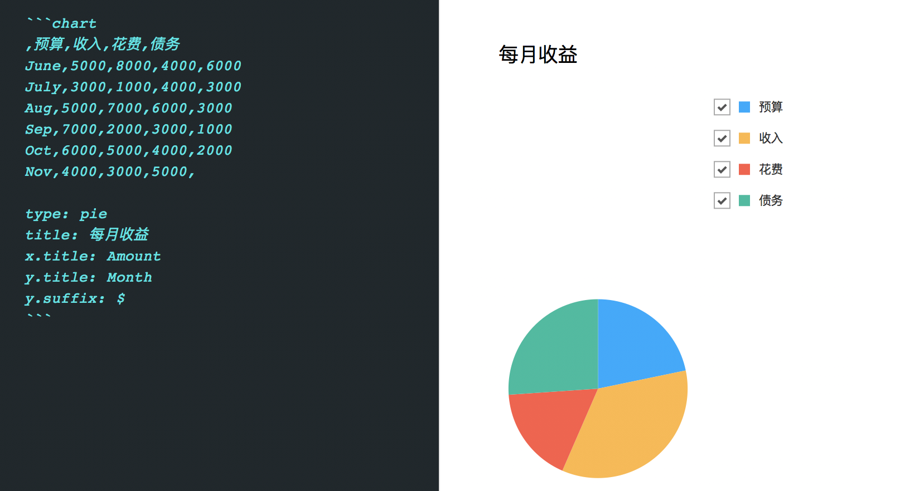
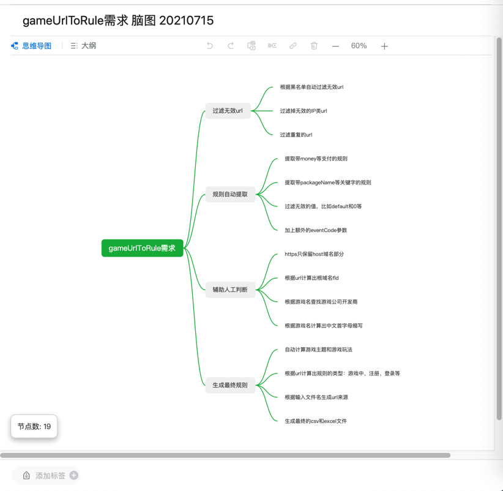

# Markdown

此处`Markdown`类型的文件格式中，如果客户端或网页支持内部的库，也可以用`Markdown`去画图，画出各种类型的图表。

常见支持`Markdown`的：

* 离线客户端软件
  * 印象笔记
  * 有道云笔记
* 在线Markdown的网站
  * TODO

## 印象笔记中的Markdown

### 普通图表

支持`饼状图`、`折线图`、`柱状图`和`条形图`。

举例：

``````markdown
```chart
,预算,收入,花费,债务
June,5000,8000,4000,6000
July,3000,1000,4000,3000
Aug,5000,7000,6000,3000
Sep,7000,2000,3000,1000
Oct,6000,5000,4000,2000
Nov,4000,3000,5000,

type: pie
title: 每月收益
x.title: Amount
y.title: Month
y.suffix: $
```
``````

效果：



另外：只需将`type`改为对应的`pie`、`line`、`column`和`bar`，即可显示不同类型图表。

### 脑图

印象笔记中的Markdown中，也可以画图。

举例：

* gameUrlToRule的脑图
  * 
