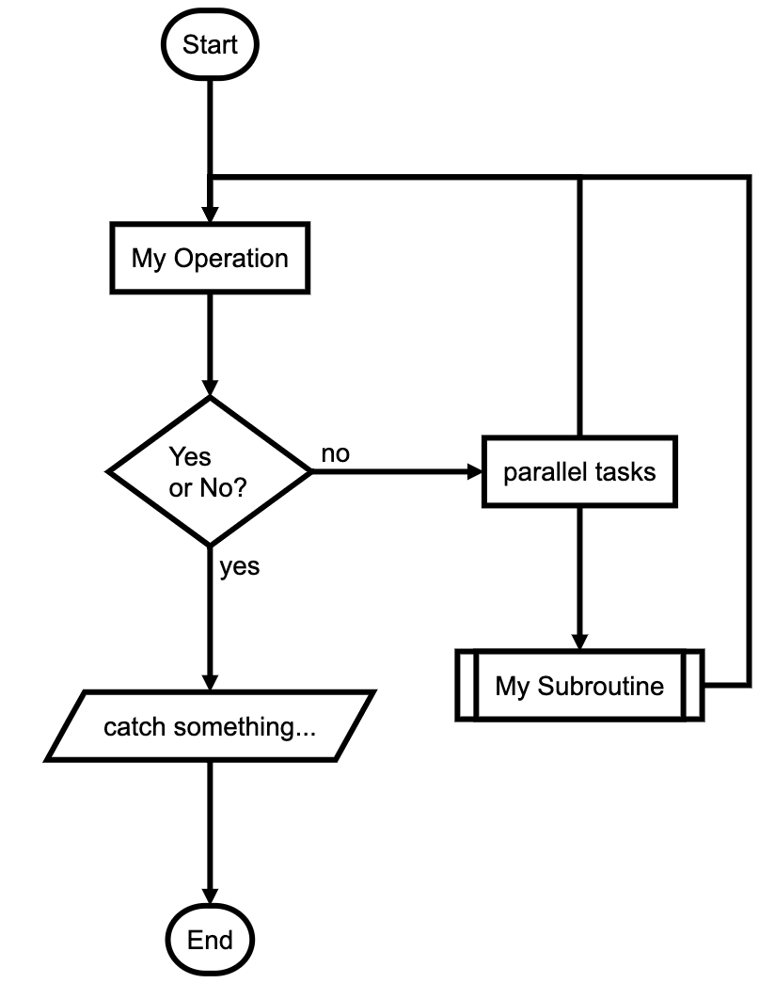

# flowchart.js

* `flowchart.js`
  * 概述：一个js库，可以用来画流程图
  * 主页
    * flowchart.js
      * http://flowchart.js.org
  * GitHub
    * adrai/flowchart.js: Draws simple SVG flow chart diagrams from textual representation of the diagram
      * https://github.com/adrai/flowchart.js
  * 举例
    * 代码
        ```js
        st=>start: Start:>http://www.google.com[blank]
        e=>end:>http://www.google.com
        op1=>operation: My Operation
        sub1=>subroutine: My Subroutine
        cond=>condition: Yes
        or No?:>http://www.google.com
        io=>inputoutput: catch something...
        para=>parallel: parallel tasks

        st->op1->cond
        cond(yes)->io->e
        cond(no)->para
        para(path1, bottom)->sub1(right)->op1
        para(path2, top)->op1
        ```
    * 效果
      * 
