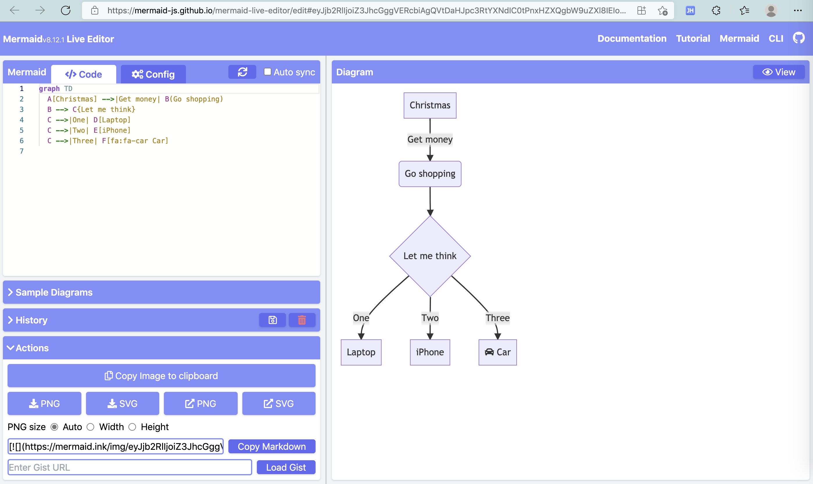
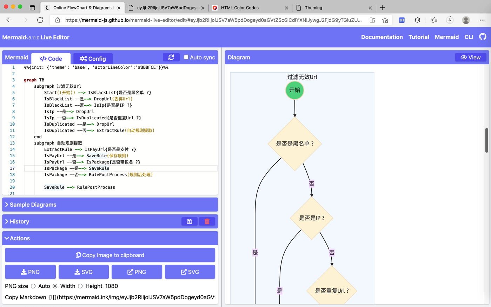
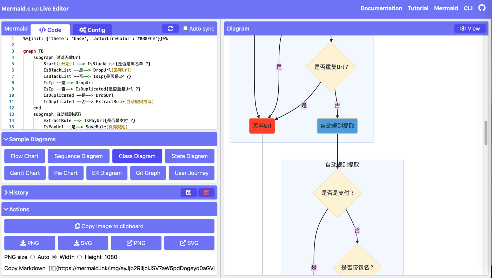
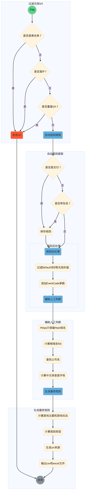

# mermaid.js

* `mermaid` = `mermaid.js`
  * 是什么：一个js库，用于画图，主要是画各种流程图等等
  * Github
    * mermaid-js/mermaid: Generation of diagram and flowchart from text in a similar manner as markdown
      * https://github.com/mermaid-js/mermaid
  * 资料
    * 文档
      * mermaid - Markdownish syntax for generating flowcharts, sequence diagrams, class diagrams, gantt charts and git graphs
        * https://mermaid-js.github.io/mermaid/
    * 举例
      * Examples - mermaid - Markdownish syntax for generating flowcharts, sequence diagrams, class diagrams, gantt charts and git graphs.
        * https://mermaid-js.github.io/mermaid/#/examples?id=message-to-self-in-loop
    * 支持不同类型的图
      * flowchart
        * https://mermaid-js.github.io/mermaid/#/flowchart
      * Sequence diagrams
        * https://mermaid-js.github.io/mermaid/#/sequenceDiagram
      * Class diagrams
        * https://mermaid-js.github.io/mermaid/#/classDiagram
      * State diagrams
        * https://mermaid-js.github.io/mermaid/#/stateDiagram
      * Entity Relationship Diagrams
        * https://mermaid-js.github.io/mermaid/#/entityRelationshipDiagram
      * User Journey Diagram
        * https://mermaid-js.github.io/mermaid/#/user-journey
      * Gantt diagrams
        * https://mermaid-js.github.io/mermaid/#/gantt
      * Pie chart diagrams
        * https://mermaid-js.github.io/mermaid/#/pie
      * Requirement Diagram
        * https://mermaid-js.github.io/mermaid/#/requirementDiagram
      * Other Examples
        * https://mermaid-js.github.io/mermaid/#/examples

## 在线编辑（预览、导出）

* Mermaid live editor
  * https://mermaid-js.github.io/mermaid-live-editor/edit
    * 
  * 特点
    * 支持设置参数，但包括自定义主题theme
  * 如何导出图片
    * png
      * Action -> 点击第一个按钮 下载PNG -> 下载保存了png图片
        * 如果想要高清晰度的，则要 先点击 PNG size，选择 Width，默认：1080，再点击 下载PNG，即可。
    * jpg
      * Action -> 点击 外链PNG -> 打开新页面，保存图片，可以保存出jpg格式的

### 效果举例

```markdown
%%{init: {'theme': 'base', 'actorLineColor':'#BB8FCE'}}%%

graph TB
    subgraph 过滤无效Url
        Start((开始)) --> IsBlackList{是否是黑名单 ?}
        IsBlackList --是--> DropUrl(丢弃Url)
        IsBlackList --否--> IsIp{是否是IP ?}
        IsIp --是--> DropUrl
        IsIp --否--> IsDuplicated{是否重复Url ?}
        IsDuplicated --是--> DropUrl
        IsDuplicated --否--> ExtractRule(自动规则提取)        
    end
    subgraph 自动规则提取
        ExtractRule --> IsPayUrl{是否是支付 ?}
        IsPayUrl --是--> SaveRule(保存规则)
        IsPayUrl --否--> IsPackage{是否带包名 ?}
        IsPackage --是--> SaveRule
        IsPackage --否--> RulePostProcess(规则后处理)
        
        SaveRule --> RulePostProcess
        
        subgraph 规则后处理
            RulePostProcess --> FilterInvalidValue(过滤Default和0等无效的值)
            FilterInvalidValue --> AddEventCode(添加EventCode参数)
            AddEventCode --> AssistManualCheck(辅助人工判断)
        end

    end

    subgraph 辅助人工判断
        AssistManualCheck --> KeepHttpsOnlyHost(Https只保留Host域名)
        KeepHttpsOnlyHost --> CalcFld(计算根域名fld)
        CalcFld --> FindCompany(查找公司名)
        FindCompany --> GenZhcnFisrtLetter(计算中文拼音首字母)
        GenZhcnFisrtLetter --> GenFinalRule(生成最终规则)
    end

    subgraph 生成最终规则
        GenFinalRule --> CalcThemePlay(计算游戏主题和游戏玩法)
        CalcThemePlay --> CalcUrlRuleType(计算规则类型)
        CalcUrlRuleType --> GenUrlSource(生成url来源)
        GenUrlSource --> OutputFileCsvExcel(输出csv和excel文件)

        OutputFileCsvExcel --> End
        DropUrl --> End((结束))
    end

style Start fill:#58D68D,stroke-width:2px
    style DropUrl fill:#FF5733,stroke-width:1px
    
    style End fill:#85929E,stroke-width:2px
    style ExtractRule fill:#5DADE2,stroke-width:2px
    style RulePostProcess fill:#5DADE2,stroke-width:2px
    style AssistManualCheck fill:#5DADE2,stroke-width:2px
    style GenFinalRule fill:#5DADE2,stroke-width:2px
```

效果：

* 在线预览
  * 
  * 
* 导出图片
  * 

