# Markdown

TODO：

* 考虑把这部分Markdown内容，整理到：
  * [其他中的Markdown](../../../../draw_tool/other/markdown/README.md)

------

支持`Markdown`格式的客户端中，如果内部支持`mermaid.js`，则也可以用来画`流程图`、`时序图`、`甘特图等`等图表。

常见支持`Markdown`的：

* 离线客户端软件
  * 印象笔记
  * 有道云笔记
* 在线`Markdown`的`mermaid`网站
  * mermaid.js的Online Editor
    * https://mermaid-js.github.io/mermaid-live-editor/edit/

## 对比

### 印象笔记 vs mermaid.js Online Editor

mermaid.js的代码：

``````markdown

```mermaid
%%{init: {'theme': 'base', 'actorLineColor':'#BB8FCE'}}%%
graph TB
    subgraph 过滤无效Url
        Start((开始)) --> IsBlackList{是否是黑名单 ?}
        IsBlackList --是--> DropUrl(丢弃Url)
        IsBlackList --否--> IsIp{是否是IP ?}
        IsIp --是--> DropUrl
        IsIp --否--> IsDuplicated{是否重复Url ?}
        IsDuplicated --是--> DropUrl
        IsDuplicated --否--> ExtractRule(自动规则提取)        
    end
    subgraph 自动规则提取
        ExtractRule --> IsPayUrl{是否是支付 ?}
        IsPayUrl --是--> SaveRule(保存规则)
        IsPayUrl --否--> IsPackage{是否带包名 ?}
        IsPackage --是--> SaveRule
        IsPackage --否--> RulePostProcess(规则后处理)
        
        SaveRule --> RulePostProcess
        
        subgraph 规则后处理
            RulePostProcess --> FilterInvalidValue(过滤Default和0等无效的值)
            FilterInvalidValue --> AddEventCode(添加EventCode参数)
            AddEventCode --> AssistManualCheck(辅助人工判断)
        end
    end
    
    subgraph 辅助人工判断
        AssistManualCheck --> KeepHttpsOnlyHost(Https只保留Host域名)
        KeepHttpsOnlyHost --> CalcFld(计算根域名fld)
        CalcFld --> FindCompany(查找公司名)
        FindCompany --> GenZhcnFisrtLetter(计算中文拼音首字母)
        GenZhcnFisrtLetter --> GenFinalRule(生成最终规则)
    end
    
    subgraph 生成最终规则
        GenFinalRule --> CalcThemePlay(计算游戏主题和游戏玩法)
        CalcThemePlay --> CalcUrlRuleType(计算规则类型)
        CalcUrlRuleType --> GenUrlSource(生成url来源)
        GenUrlSource --> OutputFileCsvExcel(输出csv和excel文件)
        OutputFileCsvExcel --> End
        DropUrl --> End((结束))
    end
style Start fill:#58D68D,stroke-width:2px
    style DropUrl fill:#FF5733,stroke-width:1px
    
    style End fill:#85929E,stroke-width:2px
    style ExtractRule fill:#5DADE2,stroke-width:2px
    style RulePostProcess fill:#5DADE2,stroke-width:2px
    style AssistManualCheck fill:#5DADE2,stroke-width:2px
    style GenFinalRule fill:#5DADE2,stroke-width:2px
```
``````

效果：

* 印象笔记
  * 编辑和预览
   * 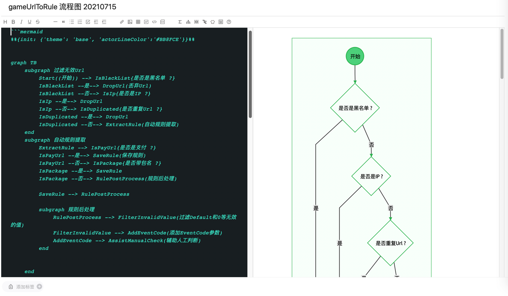
    * 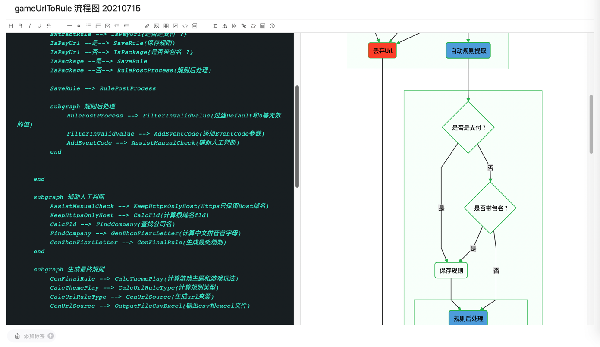
    * 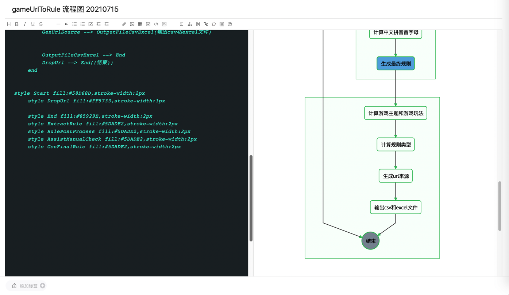
  * 导图单张图片
    * 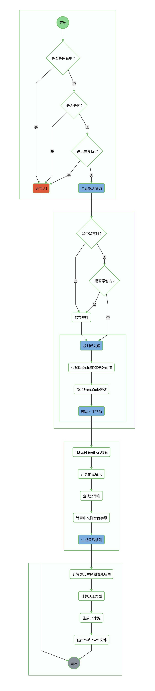
* mermaid.js Online Editor
  * 
  * 

### 印象笔记 vs VSCode vs 有道云笔记

此处，对于同一个mermaid的流程图：

关于游戏抓包自动化的流程

代码：

``````markdown
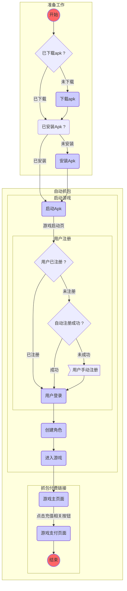
```mermaid
graph TB
    subgraph 准备工作
        Start((开始)) --> CheckDownloaded{已下载apk ?}
        CheckDownloaded --已下载--> CheckInstalled(已安装Apk ?)
        CheckDownloaded --未下载--> DownloadApk(下载apk)
        DownloadApk(下载apk) --> CheckInstalled
        CheckInstalled --未安装--> InstallApk(安装Apk)
    end
    
    subgraph 自动抓包
        subgraph 启动游戏
            CheckInstalled --已安装--> LaunchApk
            InstallApk --> LaunchApk
            LaunchApk(启动Apk) --游戏启动页--> HasRegistered{用户已注册 ?}
            subgraph 用户注册
                HasRegistered --已注册--> UserLogin
                HasRegistered --未注册--> AutoRegisterOk{自动注册成功 ?}
                        
                AutoRegisterOk --成功--> UserLogin
                AutoRegisterOk --未成功--> ManualRegister>用户手动注册]
                ManualRegister --> UserLogin
            end
            UserLogin(用户登录) --> CreateRole
            CreateRole(创建角色) --> EnterGame(进入游戏)
        end
        
        subgraph 抓包付费链接
            EnterGame(进入游戏) --> GameHome(游戏主页面)
            GameHome --点击充值相关按钮--> GamePay(游戏支付页面)
            GamePay --> End((结束))
        end
    end
    style Start fill:#f66,stroke-width:2px
    style End fill:#f66,stroke-width:2px
    style DownloadApk fill:#ccf,stroke-width:2px
    style InstallApk fill:#ccf,stroke-width:2px
    style LaunchApk fill:#ccf,stroke-width:2px
    style UserLogin fill:#ccf,stroke-width:2px
    style CreateRole fill:#ccf,stroke-width:2px
    style EnterGame fill:#ccf,stroke-width:2px
    style GameHome fill:#ccf,stroke-width:2px
    style GamePay fill:#ccf,stroke-width:2px
```
``````

效果：

* 印象笔记
  * 预览
    * 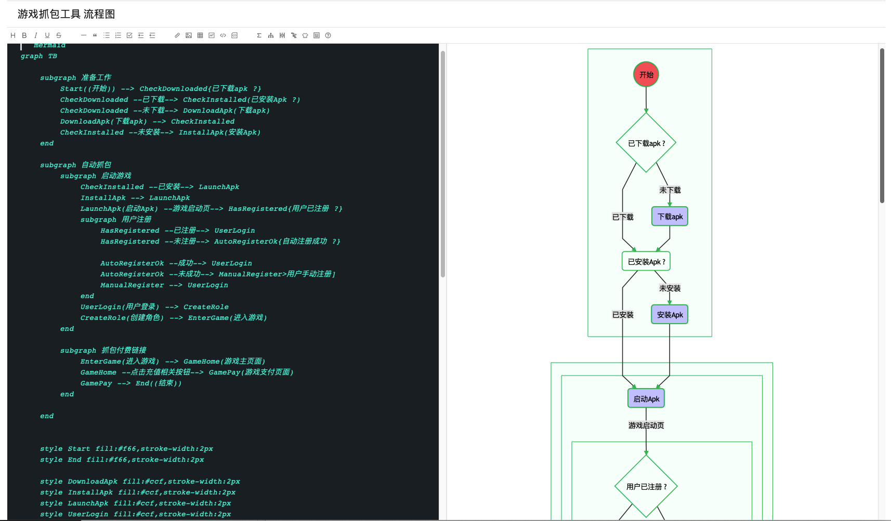
    * 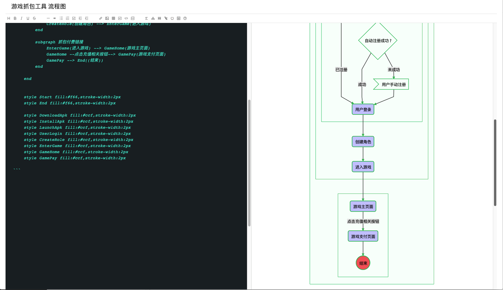
  * 导出的图
    * 通过印象笔记-》导出pdf-》mac预览导出图片-》Sngit编辑图片 ->最终导出的单张图片
      * 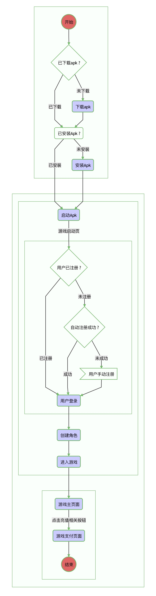
        * 评价：总体效果还是不错的。如果印象笔记支持subgraph的title显示，就更完美了
  * 注：不支持即无法显示subgraph的title
* VSCode
  * 预览
    * 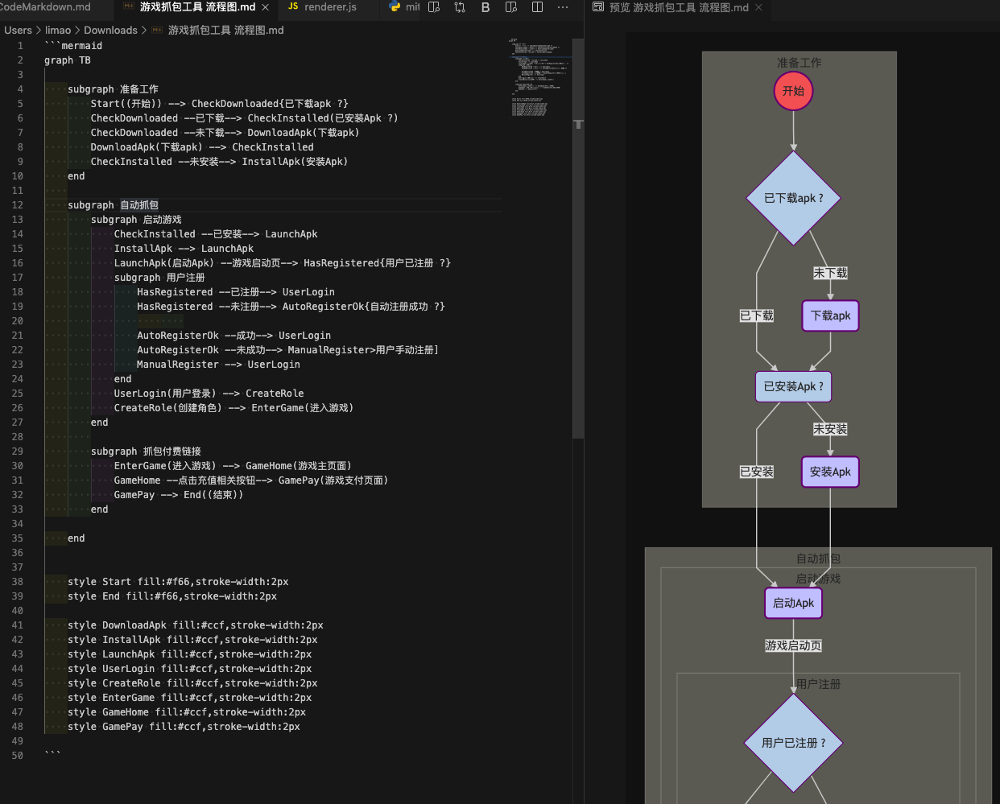
    * 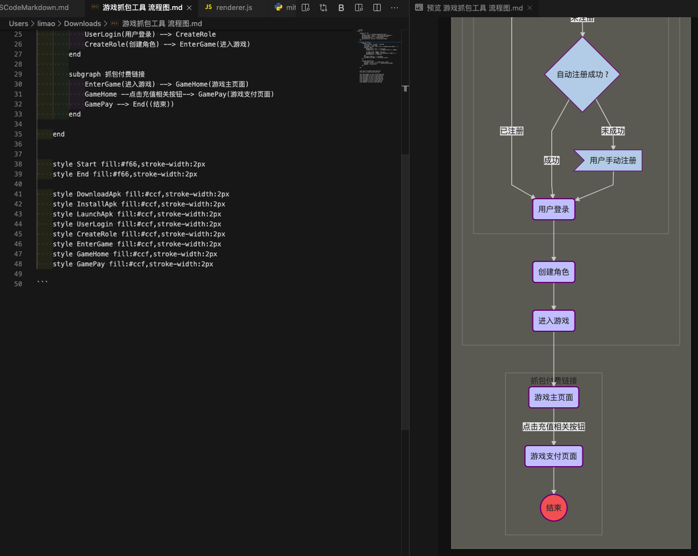
* 有道笔记本
  * Web网页版
    * 预览
      * 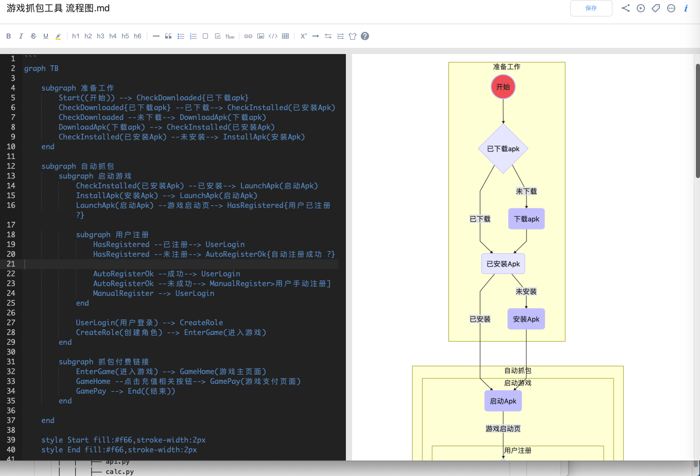
      * 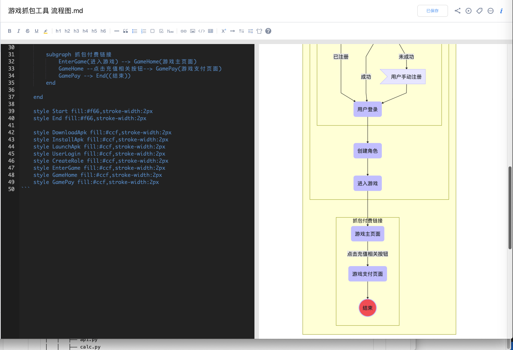
    * 注：要去掉顶部的mermaid，以及去掉多余空行，才可正常显示图
  * 特殊
    * 如果（subgraph的内部）有多余空行（或者多余空格），会导致无法显示预览效果
      * 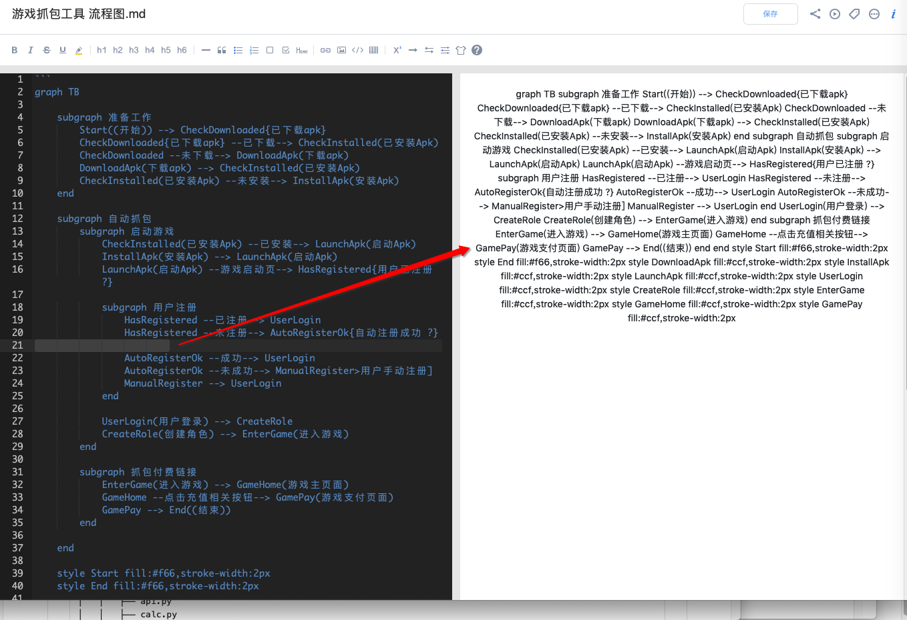
    * 与之对比：其他工具，比如印象笔记，VSCode，都可以正常预览Markdown

#### LR从左到右显示

如果有时候觉得，流程图的`TB`=`Top To Bottom`=`从顶向下`显示，太长了，不方便查看，可以考虑切换方向，比如从左到右=`LR`=`from Left to Right`

即把代码中的：

`graph TB`改为 `graph LR`

即可实现，从左到右显示：

* `graph LR`的效果
  * 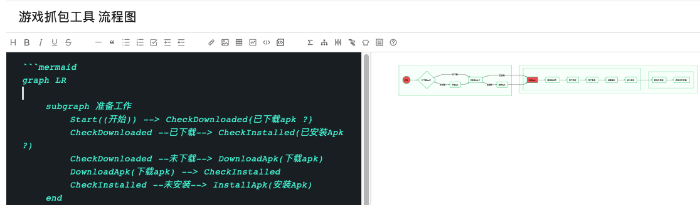

## 印象笔记中的Markdown中的Mermaid

### 流程图graph

#### 模块

代码：

``````markdown
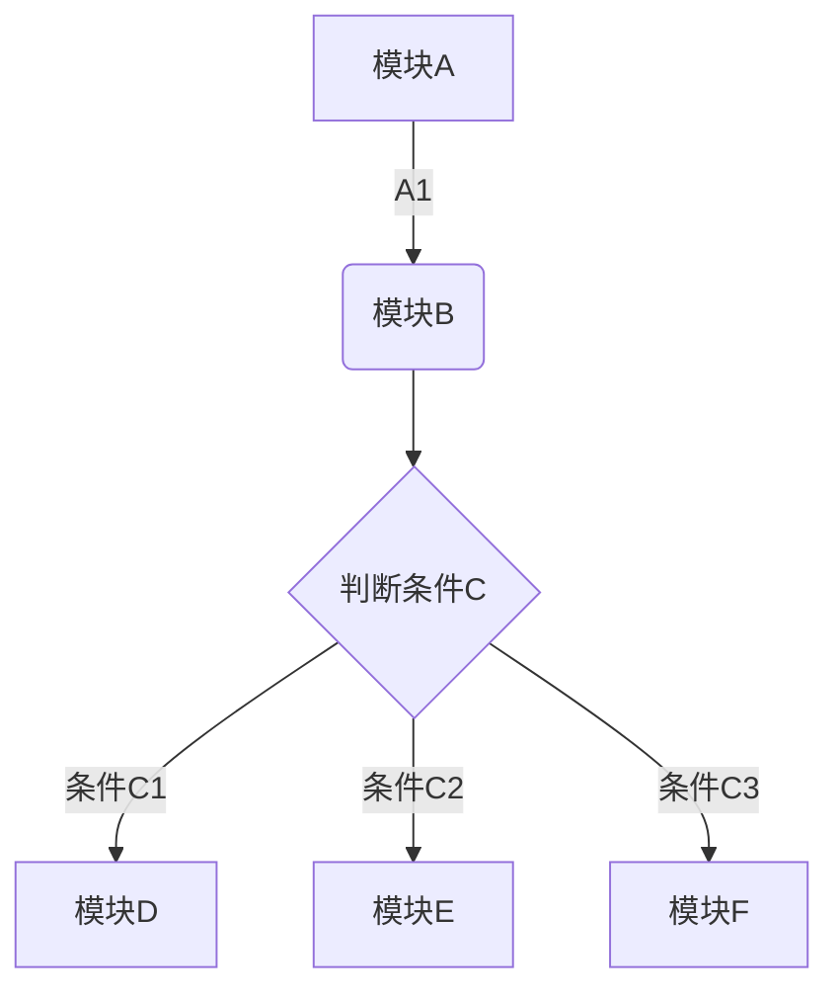
```mermaid
graph TD
A[模块A] -->|A1| B(模块B)
B --> C{判断条件C}
C -->|条件C1| D[模块D]
C -->|条件C2| E[模块E]
C -->|条件C3| F[模块F]
```
``````

效果：

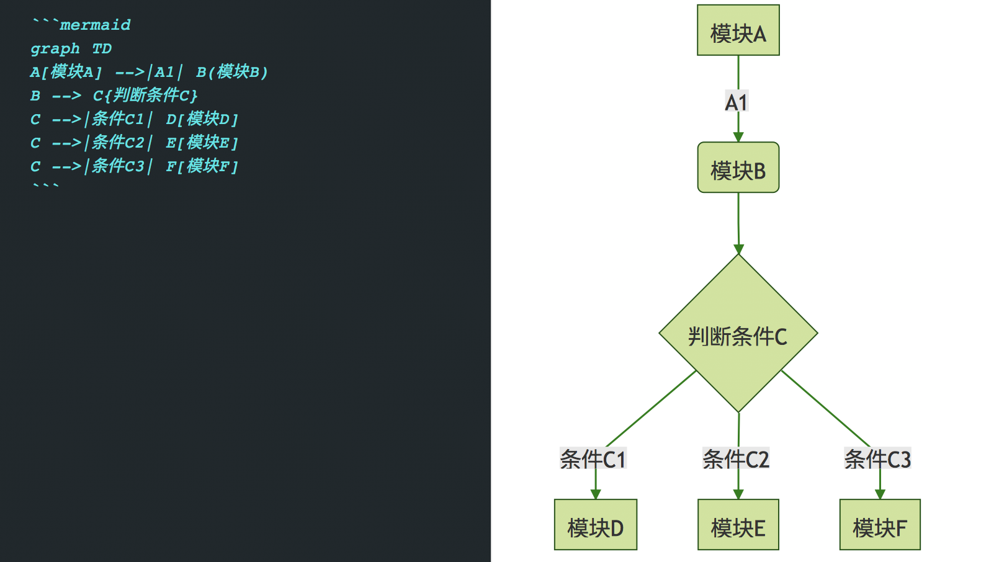

#### iOS返回前一页

代码：

``````markdown
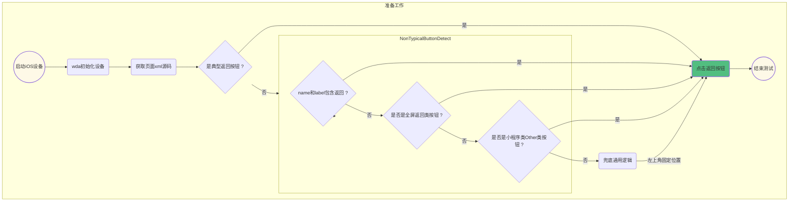
```mermaid
graph TB
    subgraph 准备工作
        Start((启动iOS设备)) --> WdaInitDevice(wda初始化设备)
        WdaInitDevice --> GetPageXmlSource(获取页面xml源码)
        GetPageXmlSource --> IsTypicalBackButton{是典型返回按钮 ?}
        IsTypicalBackButton --是--> ClickBackButton(点击返回按钮)
        IsTypicalBackButton --否--> NonTypicalButtonDetect(非典型返回按钮检测)
        FixPositionDetect --左上角固定位置--> ClickBackButton
        ClickBackButton(点击返回按钮) --> End((结束测试))
    end
    
    subgraph NonTypicalButtonDetect
        NonTypicalButtonDetect --> IsNameLabelContainBack{name和label包含返回 ?}
        IsNameLabelContainBack --是--> ClickBackButton
        IsNameLabelContainBack --否--> IsFullScreenBack{是否是全屏返回类按钮 ?}
        IsFullScreenBack --是--> ClickBackButton
        IsFullScreenBack --否--> IsMiniprogramOther{是否是小程序类Other类按钮 ?}
        IsMiniprogramOther --是--> ClickBackButton
        IsMiniprogramOther --否--> FixPositionDetect(兜底通用逻辑)
    end
    style Start fill:#FEF9E7,stroke-width:2px
    style End fill:#FEF9E7,stroke-width:2px
    style ClickBackButton fill:#52BE80,stroke-width:2px
```
``````

效果：

不够好看，只算凑合够用

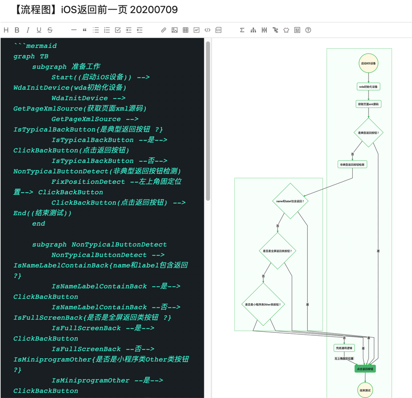

#### 客户流转

代码：

``````markdown
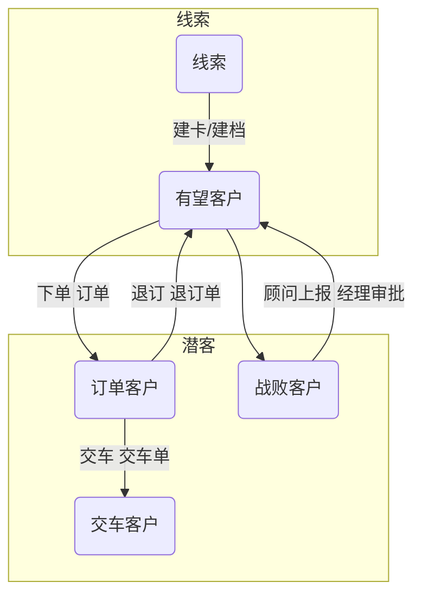
```mermaid
graph TB
    subgraph 线索
    Clue(线索) --建卡/建档--> ProspectCustomer(有望客户)
    end
    
    subgraph 潜客
    ProspectCustomer(有望客户) --下单 订单--> OrderCustomer(订单客户)
    OrderCustomer(订单客户) --交车 交车单--> DeliveryCustomer(交车客户)
    ProspectCustomer(有望客户) --> FailedCustomer(战败客户)
    FailedCustomer(战败客户) --顾问上报 经理审批--> ProspectCustomer(有望客户)
    OrderCustomer(订单客户) -- 退订 退订单--> ProspectCustomer(有望客户)
    end
```
``````

效果：

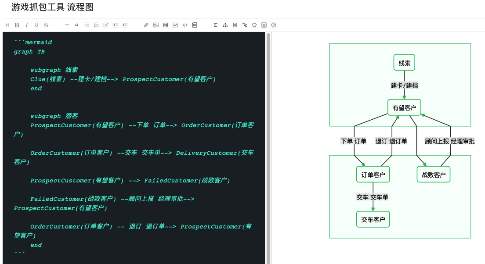

#### 游戏抓包

* 简单的：

代码：

``````markdown
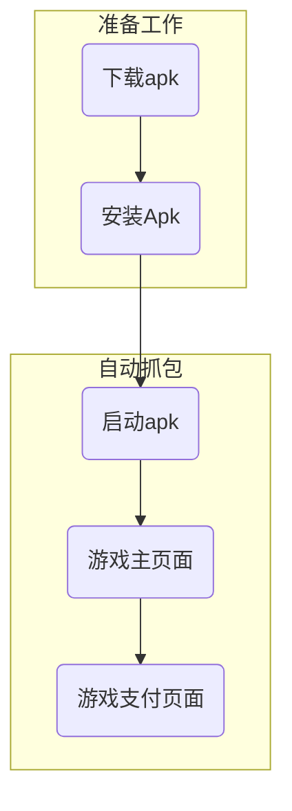
```mermaid
graph TB
    subgraph 准备工作
    DownloadApk(下载apk) --> InstallApk(安装Apk)
    end
    subgraph 自动抓包
    InstallApk(安装Apk) --> LaunchApk(启动apk)
    LaunchApk(启动apk) --> GameHome(游戏主页面)
    GameHome(游戏主页面) --> GamePay(游戏支付页面)
    end
```
``````

效果：

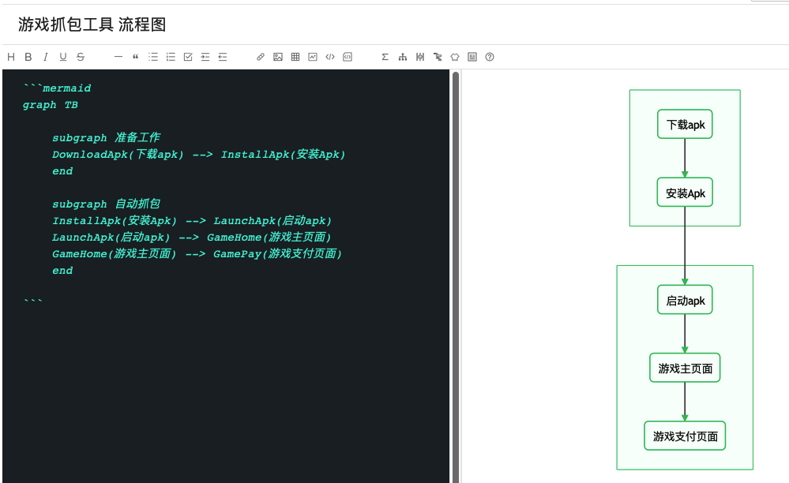


* 复杂的：带subgraph的

代码：

``````markdown
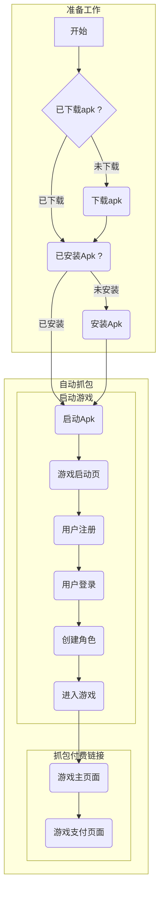
```mermaid
graph TB
    subgraph 准备工作
        Start[开始] --> CheckDownloaded{已下载apk ?}
        CheckDownloaded --已下载--> CheckInstalled(已安装Apk ?)
        CheckDownloaded --未下载--> DownloadApk(下载apk)
        DownloadApk(下载apk) --> CheckInstalled
        CheckInstalled --未安装--> InstallApk(安装Apk)
    end
    
    subgraph 自动抓包
        subgraph 启动游戏
            CheckInstalled --已安装--> LaunchApk(启动Apk)
            InstallApk --> LaunchApk
            LaunchApk --> LaunchPage(游戏启动页)
            LaunchPage(游戏启动页) --> UserRegister(用户注册)
            UserRegister(用户注册) --> UserLogin(用户登录)
            UserLogin(用户登录) --> CreateRole(创建角色)
            CreateRole(创建角色) --> EnterGame(进入游戏)
        end
        
        subgraph 抓包付费链接
            EnterGame(进入游戏) --> GameHome(游戏主页面)
            GameHome(游戏主页面) --> GamePay(游戏支付页面)
        end
    end
```
``````

效果：

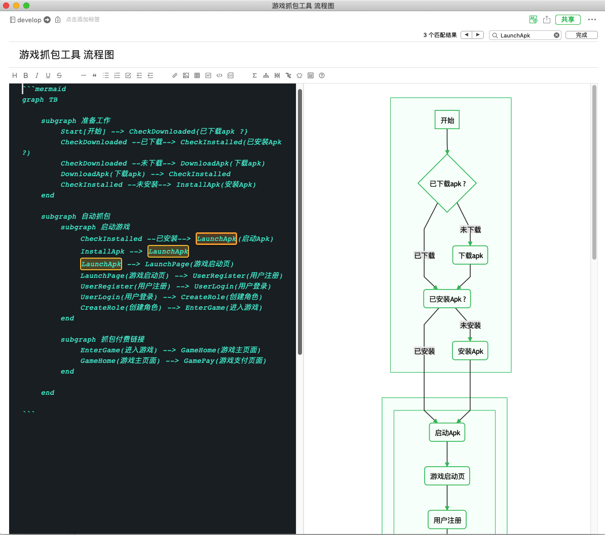

#### 商品货物

``````markdown
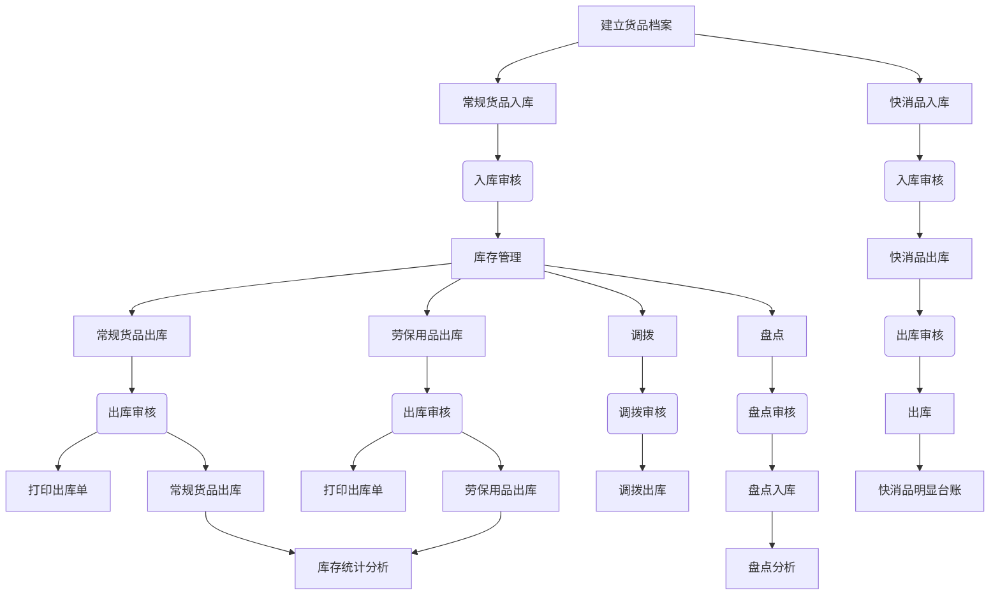
```mermaid
graph TD
A[建立货品档案] --> B1[常规货品入库]
B1 --> C1(入库审核)
C1 --> D1[库存管理]
D1 --> E1[常规货品出库] 
D1 --> E2[劳保用品出库] 
D1 --> E3[调拨] 
D1 --> E4[盘点] 
E1 --> F1(出库审核)
E2 --> F2(出库审核)
E3 --> F3(调拨审核)
E4 --> F4(盘点审核)
F1 --> G1[打印出库单]
F1 --> H1[常规货品出库]
F2 --> G2[打印出库单]
F2 --> H2[劳保用品出库]
H1 --> I1[库存统计分析]
H2 --> I1
F3 --> G3[调拨出库]
F4 --> G4[盘点入库]
G4 --> H4[盘点分析]

A --> B2[快消品入库]
B2 --> C2(入库审核)
C2 --> D2[快消品出库]
D2 --> E5(出库审核)
E5 --> F5[出库]
F5 --> G5[快消品明显台账]
```
``````

### 时序图

代码：

``````markdown
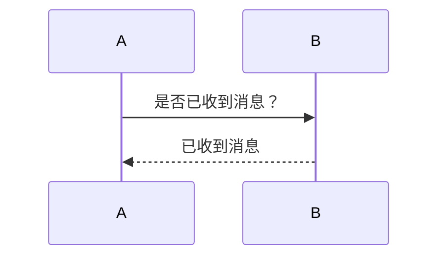
```mermaid
sequenceDiagram
A->>B: 是否已收到消息？
B-->>A: 已收到消息
```
``````

效果：

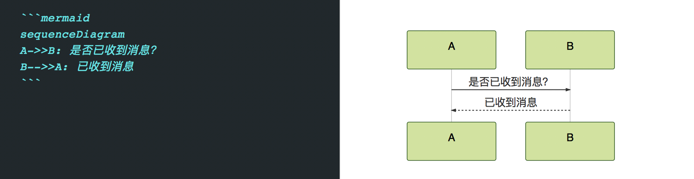

### 甘特图

代码：

``````markdown
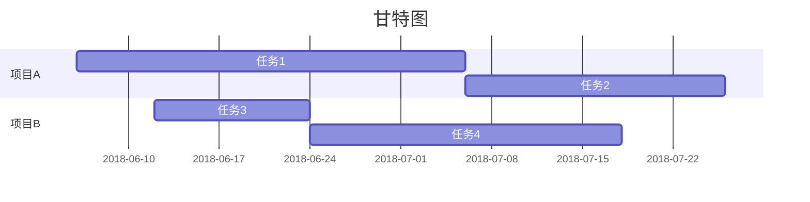
```mermaid
gantt
title 甘特图
dateFormat YYYY-MM-DD
section 项目A
任务1 :a1, 2018-06-06, 30d
任务2 :after a1 , 20d
section 项目B
任务3 :2018-06-12 , 12d
任务4 : 24d
```
``````

效果：

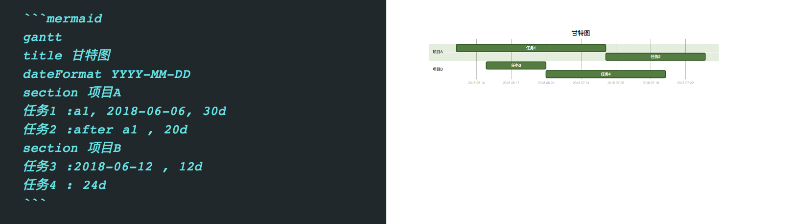
