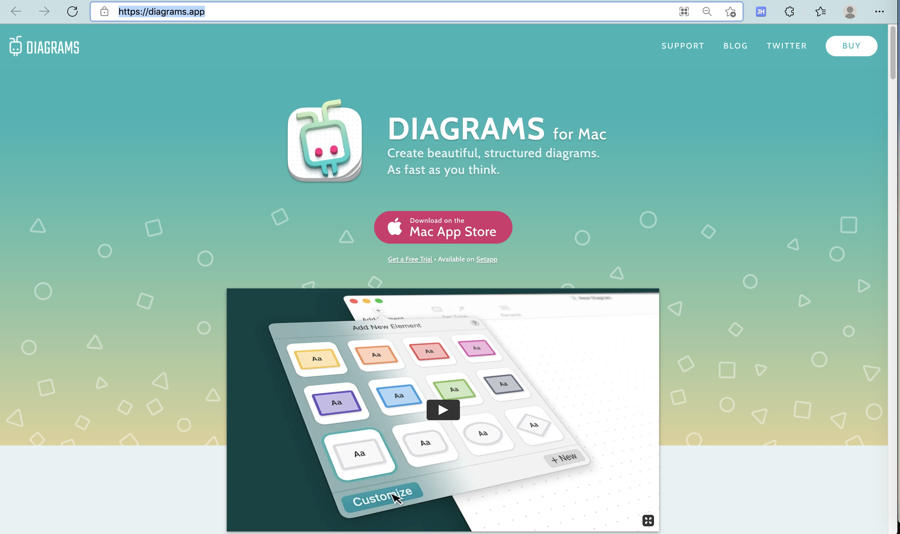
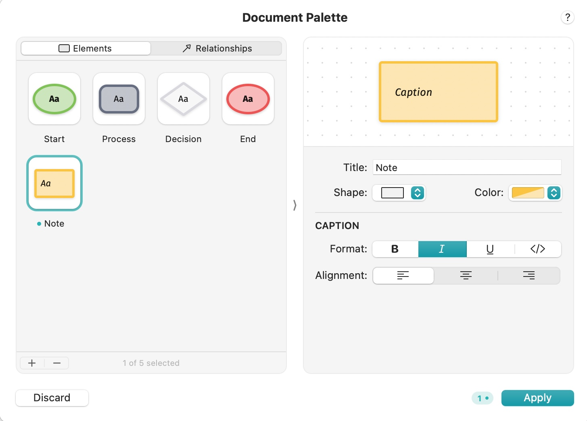
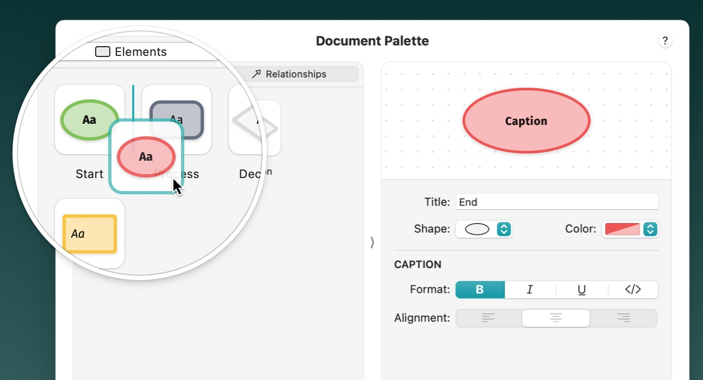
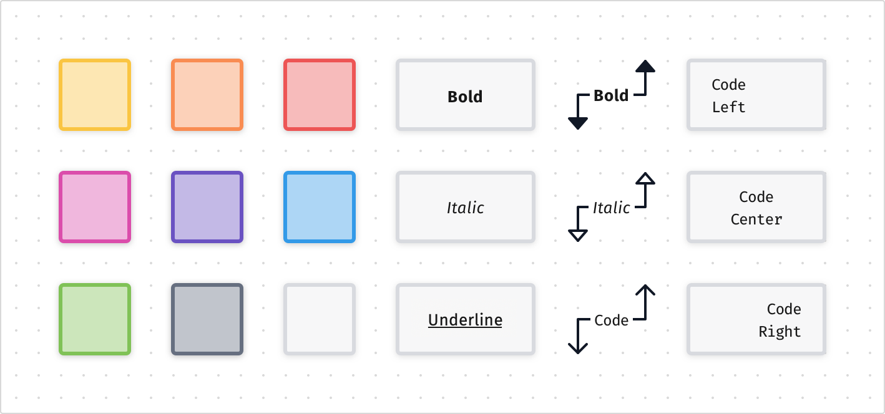
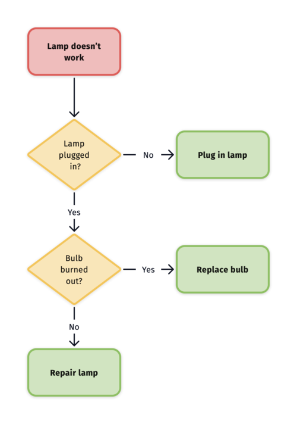
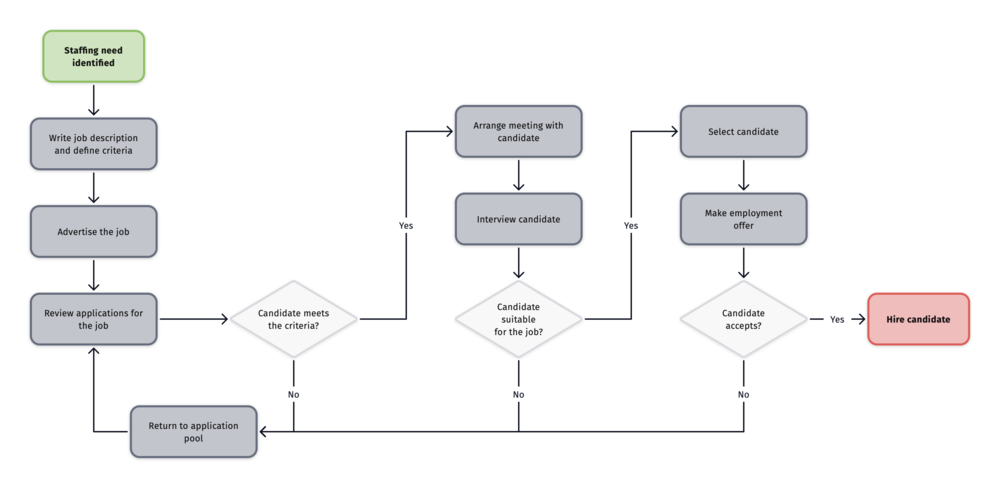
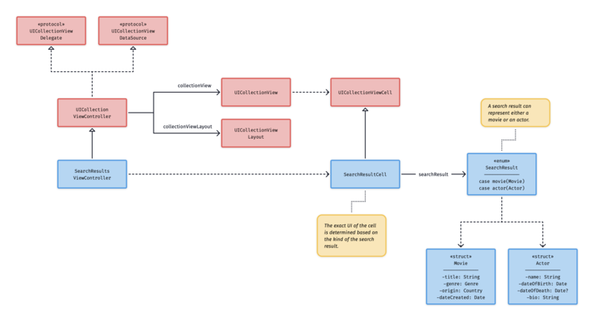
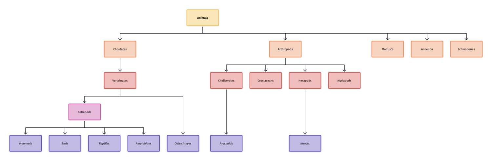
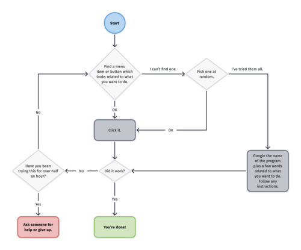

# Diagrams

* `Diagrams`
  * 总体评价：功能基本够用，界面还算好看
  * 主页
    * Diagrams: A Native Diagram Editor for Mac
      * https://diagrams.app/
      * 
  * 功能
    * 编辑
      * 
      * 
      * 
    * 流程图
      * 普通
        * 
      * 业务流程
        * 
      * 软件开发
        * 
      * 组织架构
        * 
      * 其他
        * 
