# draw.io

* draw.io
  * 总体评价：功能还行，但是编辑功能不太好用。总体算能凑合用。
  * 优点
    * 免费
    * 够用
  * 缺点
    * 编辑功能不好用
      * 编辑期间，点击元素后，很容易和其他元素误连接在一起
      * 以及点击已有箭头去编辑连接对象，长短等期间，操作很繁琐和麻烦
      * 总体上的编辑体验，很差，不人性化，容易误操作
      * 所以以后少用，甚至不用这个draw.io了
  * 如何使用
    * 在线网站
      * draw.io
        * https://www.draw.io
      * 注：20210909 最新已跳转到：
        * https://app.diagrams.net/
          * 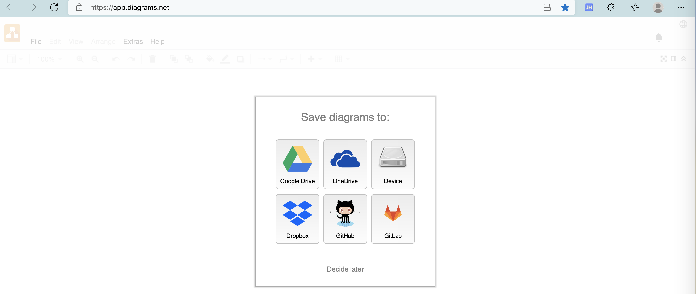
          * 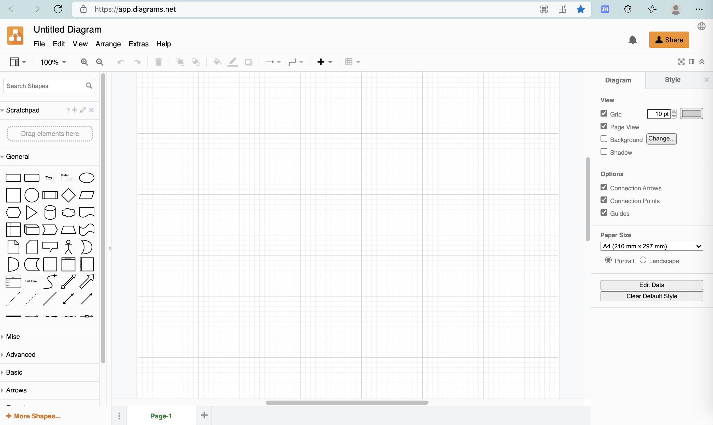
        * 对应主页：
          * Diagram Software and Flowchart Maker
            * https://www.diagrams.net/
              * 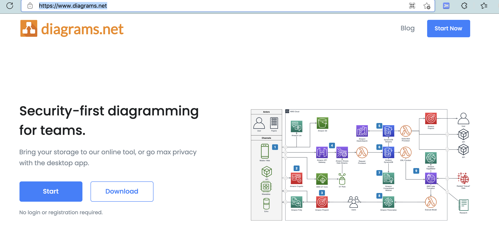
    * （离线）客户端（软件）
      * 下载地址
        * Release 14.9.6 · jgraph/drawio-desktop
          * https://github.com/jgraph/drawio-desktop/releases/latest
            * Mac
              * Intel x86
                * https://github.com/jgraph/drawio-desktop/releases/download/v14.9.6/draw.io-x64-14.9.6.dmg
              * Apple M1
                * https://github.com/jgraph/drawio-desktop/releases/download/v14.9.6/draw.io-arm64-14.9.6.dmg

## 举例

### 用draw.io去画iOS自动化测试系统架构图

#### draw.io：在线网站

* draw.io：在线网站
  * 入口：https://www.draw.io
  * 弹框问保存位置
    * 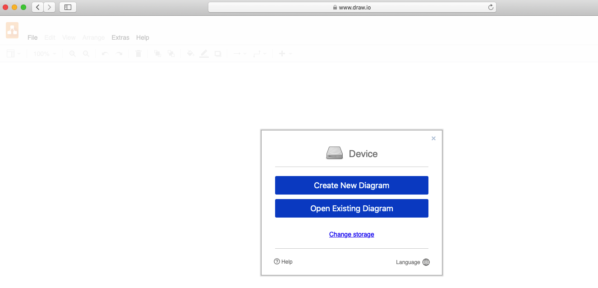
  * 保存文件名：`GameAutomationTool_SystemArchitecture.drawio`
    * 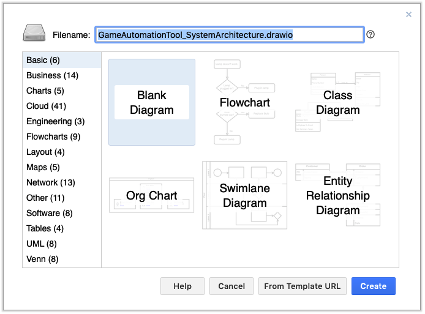
  * 新建画布
    * 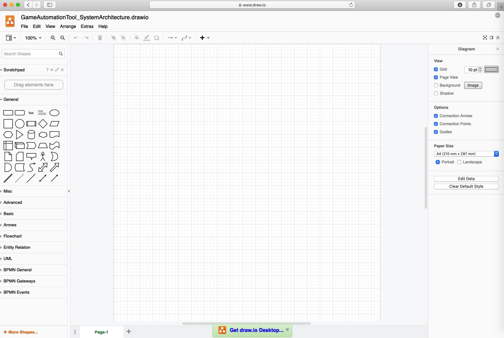
  * 查看有哪些元素可用
    * 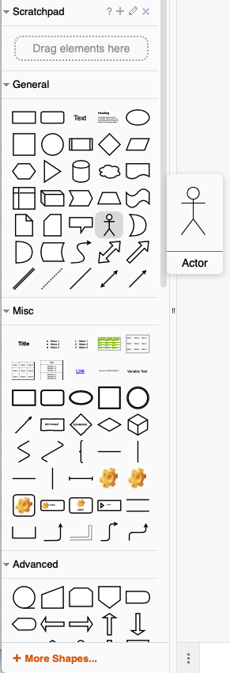
    * 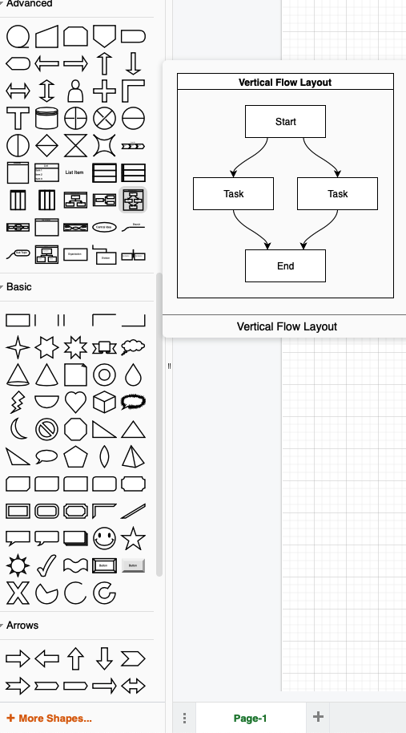
    * 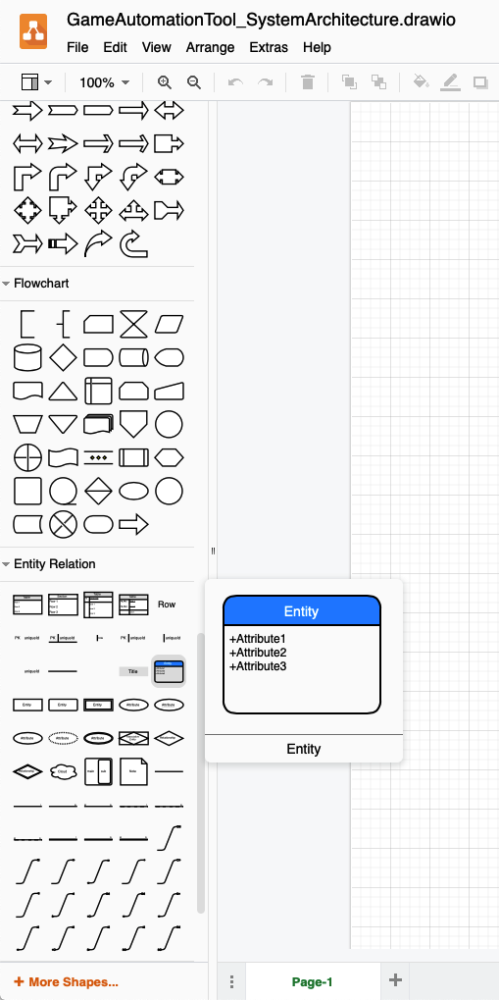
  * 画图过程
    * 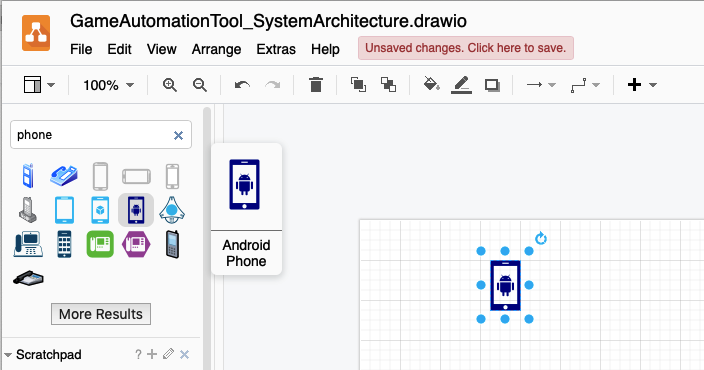
    * 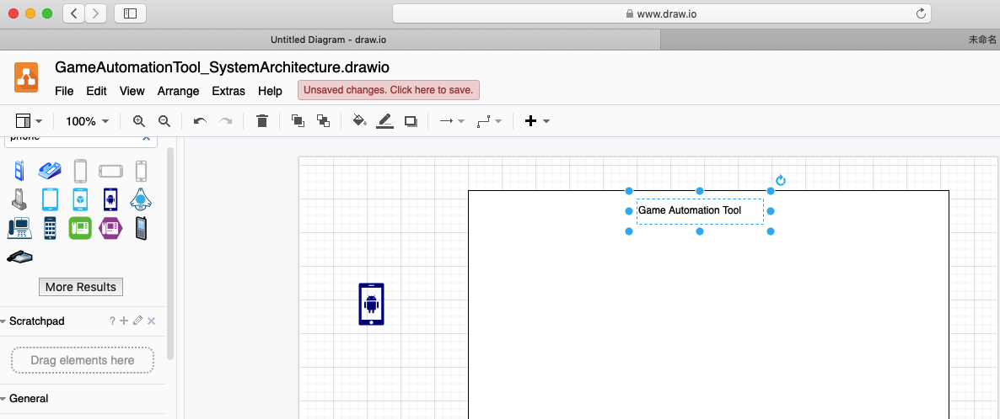
    * 保存：点击`Unsaved changes. Click here to save`，会下载xml文件
      * 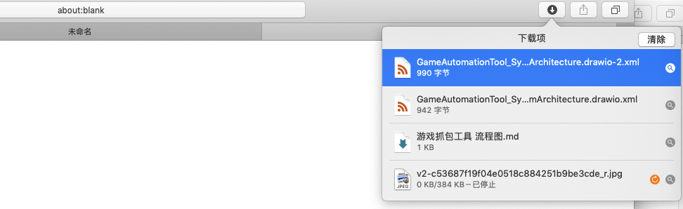
    * 改变了语言为 简体中文 后 刷新页面，重新加载
      * 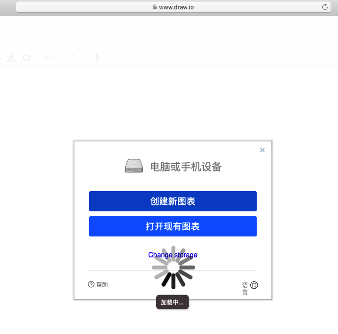
    * 显示界面变中文
      * 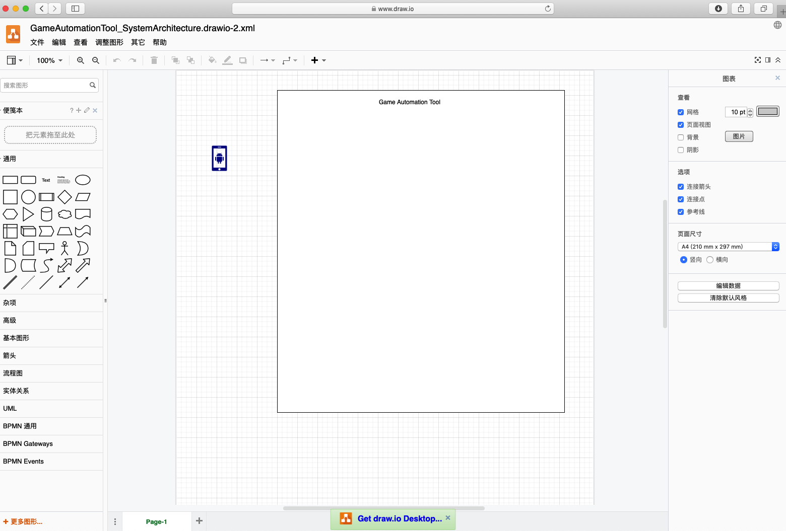

#### draw.io：Mac本地客户端

* draw.io：Mac本地客户端
  * 打开draw.io
    * 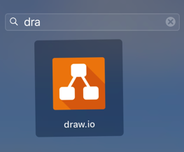
  * 打开本地已有文件
    * 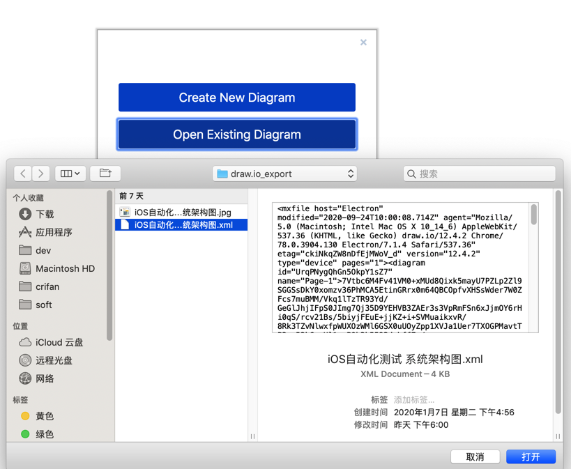
  * 编辑期间
    * 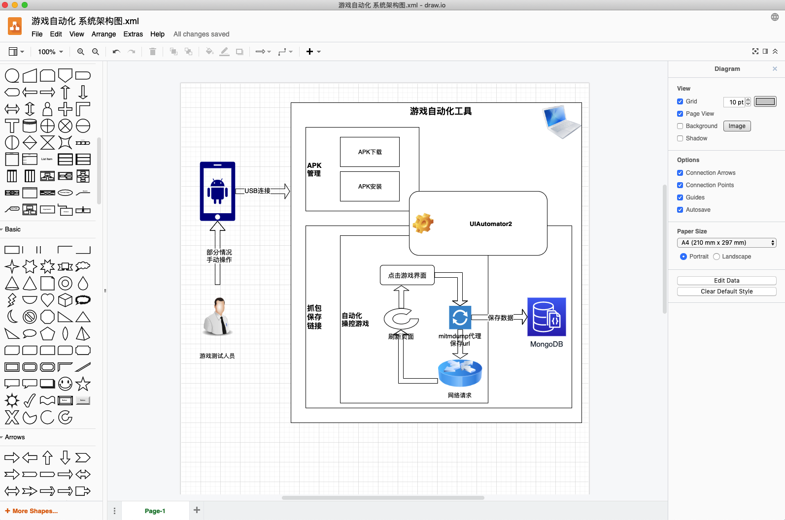
    * 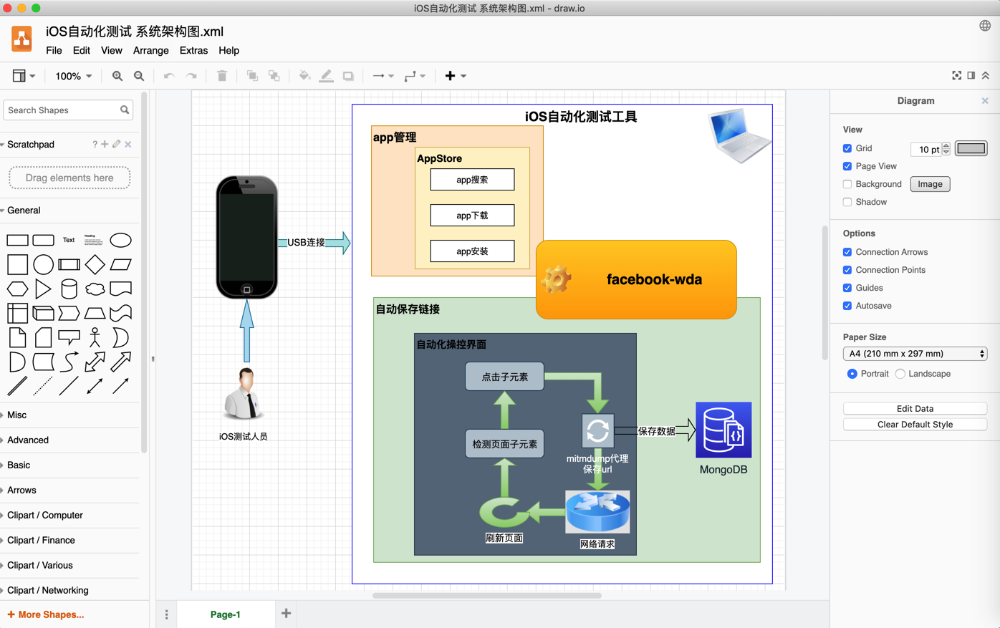
  * 导出图片
    * 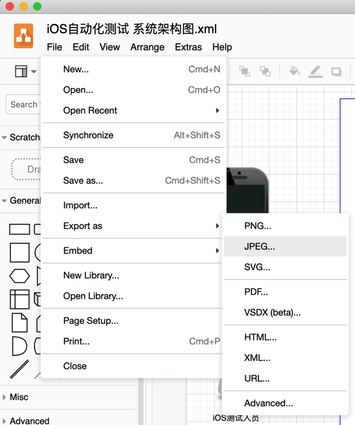
  * 最终的图
    * 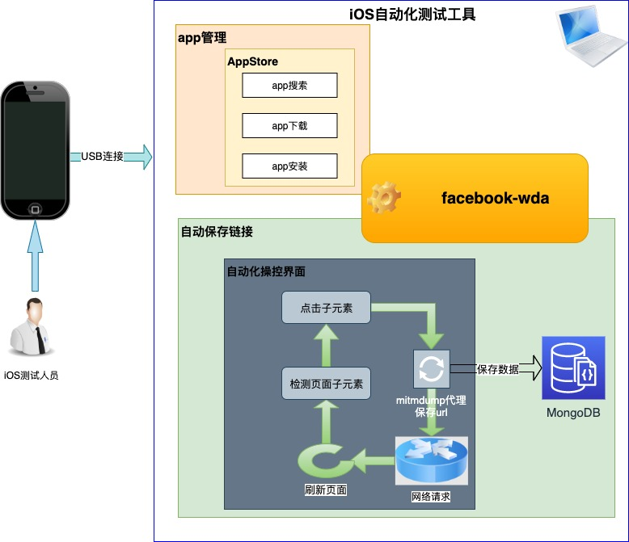
  * 导出/保存的图片原始文件：`xml`文件
    ```xml
    <mxfile host="Electron" modified="2020-09-24T10:00:08.714Z" agent="Mozilla/5.0 (Macintosh; Intel Mac OS X 10_14_6) AppleWebKit/537.36 (KHTML, like Gecko) draw.io/12.4.2 Chrome/78.0.3904.130 Electron/7.1.4 Safari/537.36" etag="ckiNkqZW8nDfEjMWoV_d" version="12.4.2" type="device" pages="1"><diagram id="UrqPNygQhGn5OkpY1sZ7" name="Page-1">7Vtbc6M4Fv41VM0+xMUd8Qixk5mayU7PZLp2Zl9SGGSsDkY0xomzv36PhMCA5EtinGRrx0m64QBCOpfvXHSsWder7W0ZFcs7muBMM/Vkq1lTzTR93Yd/GeGlJhjIFpS0JImg7Qj35D9YEHVB3ZAEr3s3VpRmFSn6xJjmOY6rHi0qS/rcv21Bs/5biyjFEuE+jjKZ+i+SVMuaikxvR/8Rk3TZvNlwxfpWUXOzWMl6GSX0uUOyZpp1XVJa1Uer7TXOGPMavtTP3ey52k6sxHl1ygPOb3b5593dzbff7n/++v2xzK7+cK6sepSnKNuIBYvJVi8NB0q6yRPMBtE1K3xekgrfF1HMrj6DzIG2rFYZnBlwGGUkzeE4wwuYVLiuSvqIr2lGSz6YpcPnBmYYyrMXC3rCZYW3HZJYzS2mK1yVL3CLuGqaYvZCt64MwxG8ft6JykFCVMuOmFxP3BgJ9Ujb0XcchAPBRDVD7+7RMvs6fXr4/uh82/xz49g/v1y5Coa6GePFHA7Sii+9JiwoLL3Lavf7hjYXrtbcFAK4wXCK7e5iO8oMabC0INBmjoYCLUDazNbCG82fMkow1Xyg+JpvaeFMm7kammmB07wb1la/vj8lIHemOaIiLEiWddQgcTBKbJWCIHNuuS5cYXpAwA4DMVBFi5HUxhmoDUIKrbF1WWusi2mN40rcxgngkDilZbWkKc2jbLajhgAoBbu6yPA2YFAHtL6Mds/9Qhn7uGS+4ap6EUAbbSralxvekupP9vjEdx1x/hc/d2xPnE+3Ynx+8tI5+YJLAhzBpaCtq6isxNymOc1xQ7shjEG7e8R8LDZOnnTO4GKKd+MyhSN52j7KtKfBZUOYjnjasGS9m+vYwq4SmDDSETqkYWu6KWMhnCDPC3y/Dv79a+78nia3meEsrgR0MsEd1MMSZ1FFnvoORqVS4tEvlHCgaGHP6Ouv32hPM4bgWf3YQDPbeZyhrJ6EcV/vOR4x9OlizUClwUArNUrEwGymNJLVr0iScGUvMQBiNOdDMdEXbHV8vU6oOVMmOCvMojnOwih+TLkddMS74B+FgsjiPmigEsy0kYeYW8+5q+DnSp8YyDd7IhRnb1WM5ha6WKzxuSJXhgnOXq92shNDSic29I3k13uVY4ODa813mWqFcMyVLQBlc9il0GPKxu7hx0pXtsfrHVXQEfyN7Z4SprS0nsO5lL+RLXicoOSO5imdnsxvuqkykgMMN7G7Ll7UsVz4uWErC9MySgjuXbOnHlzsXJuSEgYiNOfupmTMHboA+Nihr3IBLUYk0XrZ+tAGkX5h2PKFrokYfk6riq72BioSsnWUqotBZnMuuMJeGa2Lmh0LsmXzaD39apuyLGsSPa/tCSAi90g/xWw+DCDro/5dCY03K5hDMn94JtXyYcUkBCcxXRUANnOSkeplHEX39IGie5Yt6bmHZDVvaKOreZNEjhqN233FB/xvNGhH5HmOrp8WtXfADYJ1NG0cqKfNPAZxcJXF8VMtMD9J+O7anos8lQ1Zhm05tmzFrW1dLKy3GmG3Yb0lo2x7Uw9ljUvBrKHymwOxkBWvQHSZf0IYI56aklUKM8sIiP0mzkjxALE0OwTr3gDurOH4LopDSh8fDBNt4W9SQPg8grGbA3YrvZqvYLc/ArfV8bcuMfejk6h+AnU4fcqBByLzMuyG0HmSne4e5We9Z4e5V9fLuGr/6XuJ7nlvSs+Vuc7RvEltJSK2rtOWAzfa1pkJ1XnGrCjtAECHU803+EGo+dciMIUwlIWqhobeyeBzXD3T8pGlxubN75TZ/gMLB3pWL0bZvah+x8xlP+OgsGMaE7sPDK5xGi64F0NhOdrlaYacS9haGLBfcMkgUx+9j+wKTAt4gXnzB46XD3dRPjJUW8OwzJcF4imKpBcDasN/A1CfDcpDPFQh/6fFyGa/4ShGWnuqD++DkaYisQRoBBSElIsFuhwmRXlaFzk7sjh82logO/Cd1I3jQeux4l8Uo8RSSQwySdtJRopD0aA8pzI3QxWH2pcCwAYAPj4w+vB68NstsMkmjlqgpzT7j7JIS5GCKPaJXOb/Qp2nnpBoziSF+R+u3TbqP07t1mv2E9vERzureNtMyJyYynFHLe6qw2pDkvb/Kzxcwv9fFGyapOSzoM3+gltCnoblqnUR5XvKcMqimgACqai2ItUq2awKDmyhFvB4Arwuco/Xy1RzALJithdcgIzImzJ729zn5bHVDEydgzEuZ0+4xmSjNu66VYVZTa8a3jPWfVHUvrgrG5TQJc9xbo1duZ8wLJ4/YRytJmYyKUq6fXlNjPCKNNgeJMGe4U3kYrhtTxTlcLu9dfw+gxP6ff7G/o/FftuSsV+dRltjY786NLHtQcTj6YNM5cINB7ZKa7sIrNi1mbeR5JWAYrZ5U6bzH0wHQmJYAMxFHxz/QwXNkKAiUdDzXR4j+1pgsNqRYlemD8kDy3ojzHWNZIBl82hN4gloGWhtHs+yjBTr1nCCPK1D7olZF5CTHYUH8GXc2ENdYh5ahISv72Qir9hb1wfJttsQurUtVa5tno+wh5qADgHsKGqwxz/LMDdUGULXE/JlWQPsPG2Qfp7elhjnsiAj/mnFpUiiJAmeXIk0dMWeEXJlcRnepeSFjsvrJMafng1Lm/m8S9ms/2fD8l2dCbMQ3kZt83cpGhtyWsVL8fphyGUkyUJXWZ+he5aPxxGn606cvkBRs5XfrXX5sjzRpXb893uKudJNDDf33UNdSie3CChHiYqC5SXBjHmP0xOUC23oD4rhA/1ZLLAbxyr9STx/rusK/R6xP1faWTZllDBVDbrmGDv5SpjwXx+BHOkb2dMAFxTFfUVLfKSN7WCccY5iqMUqqcfC3KMe7tx1ds79PG9hDJy7oatK6a5CEYyLdWrbkiJwu3aZObPt33ojQ3Yir5LJCFZkWeYQnA3dVe1EKHb+LtZ3KBejOfdsLURiJzacst9PyT3FPvbFuKdO+NTcc5hPQT7fx7bYhtoI3DszzJO453+46hmqyPx1fh14sK1heIDiC2DmnNLHq+ckOrX3lRfDjouj3zvAugbqpoFbHJWD5g4pBJVQO05MdNCpd8ICU1cnfItF5PB7RzAzG+nH1cREKoC/mKf/PBWx3Vdxel/E0U7sImubxv5qxjvQQfYZm8UOFr2O7ozUrQjvsBFycJq9bVeX47Pe6TySKkmfvTXiPL8wbI1wfVfhFcZpjYDT3Xdr60rk7hvK1uy/</diagram></mxfile>
    ```
