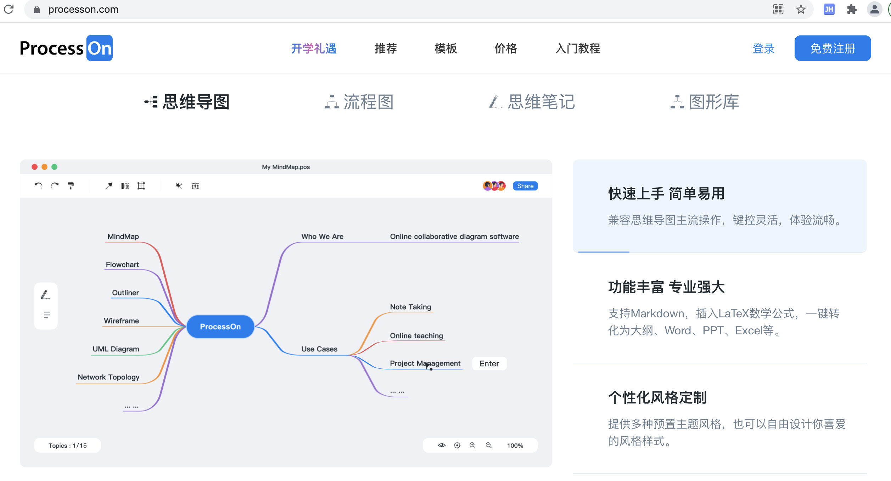
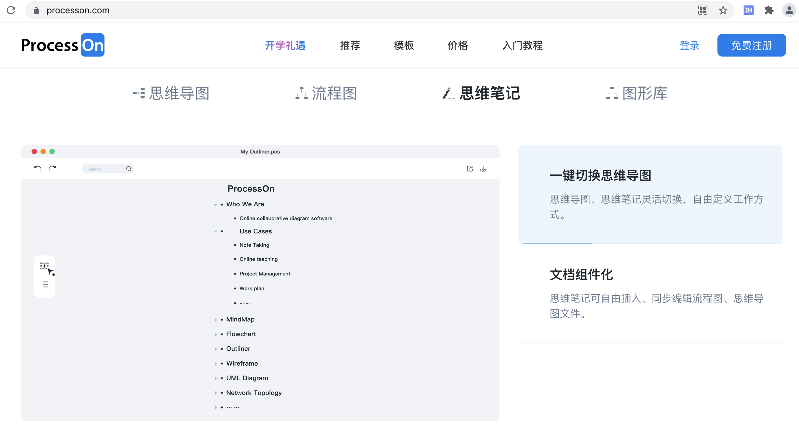
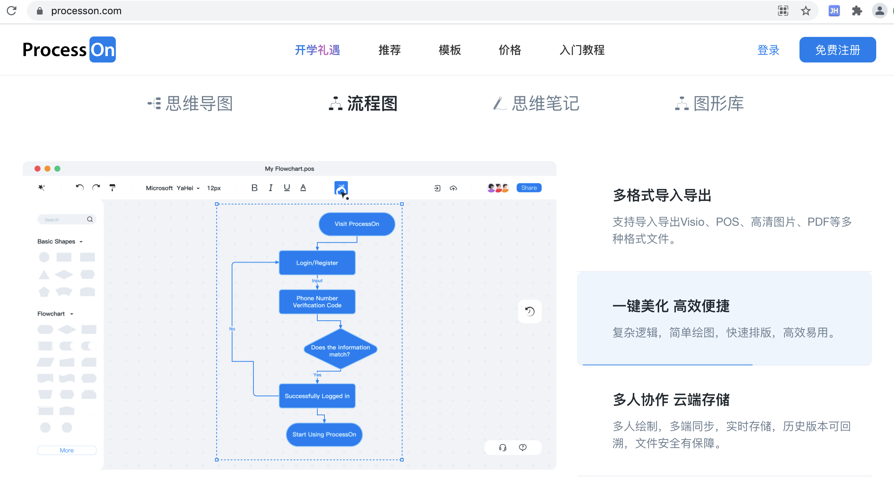
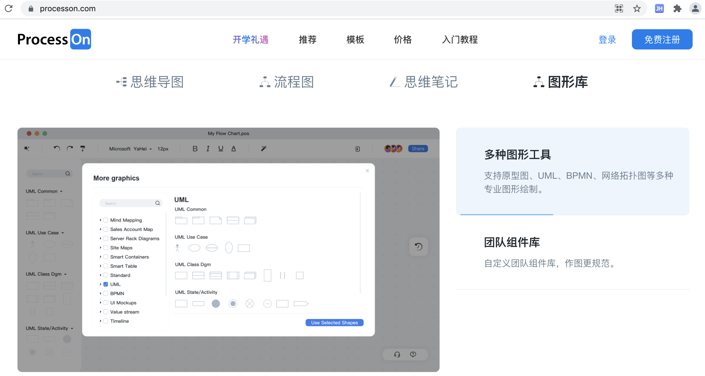
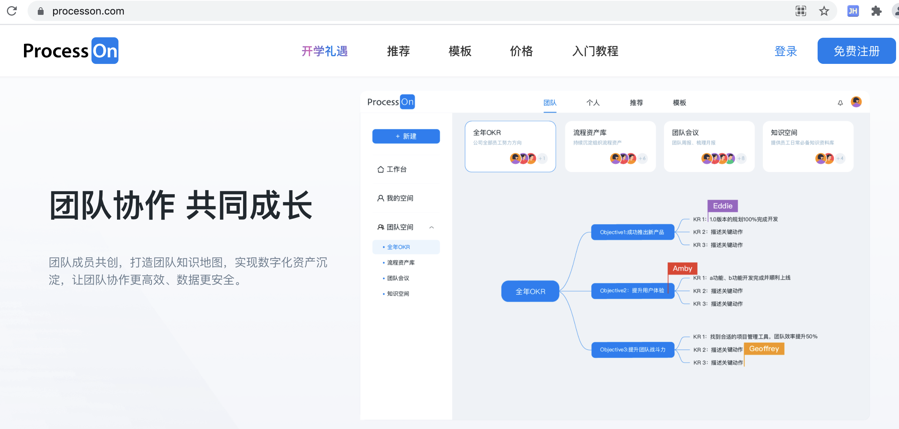
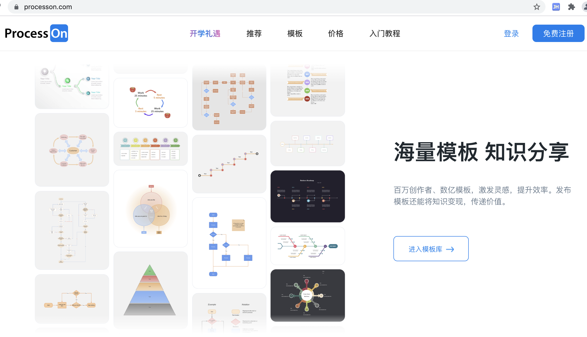
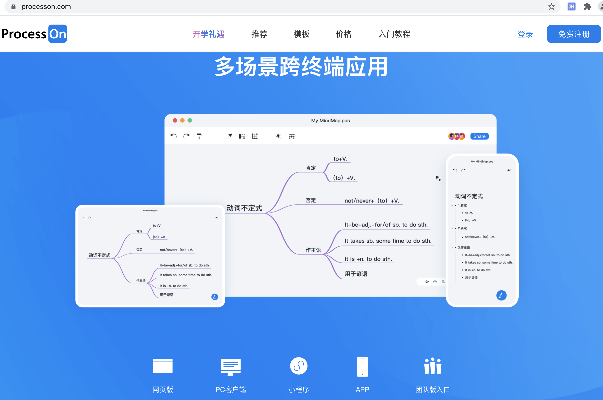
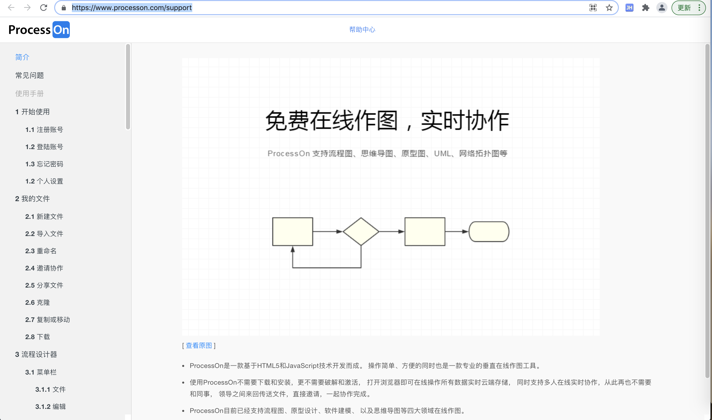
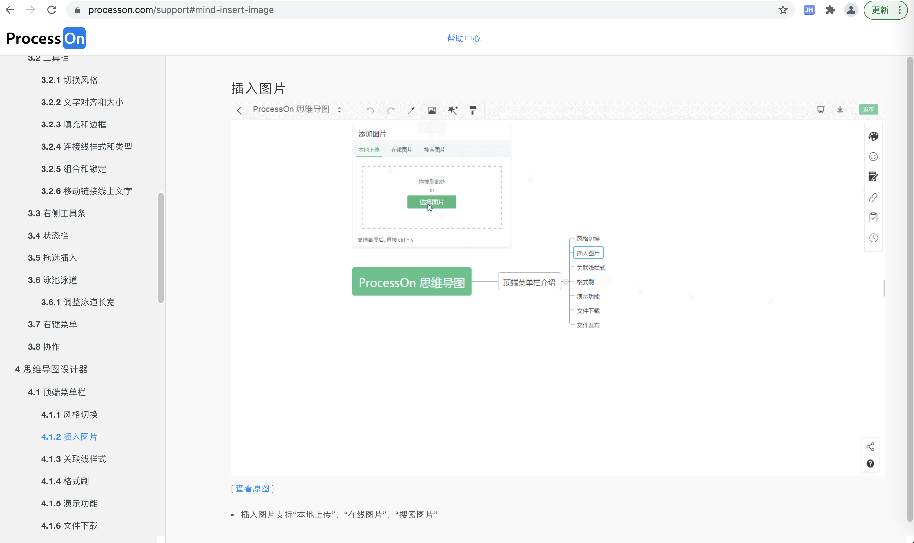
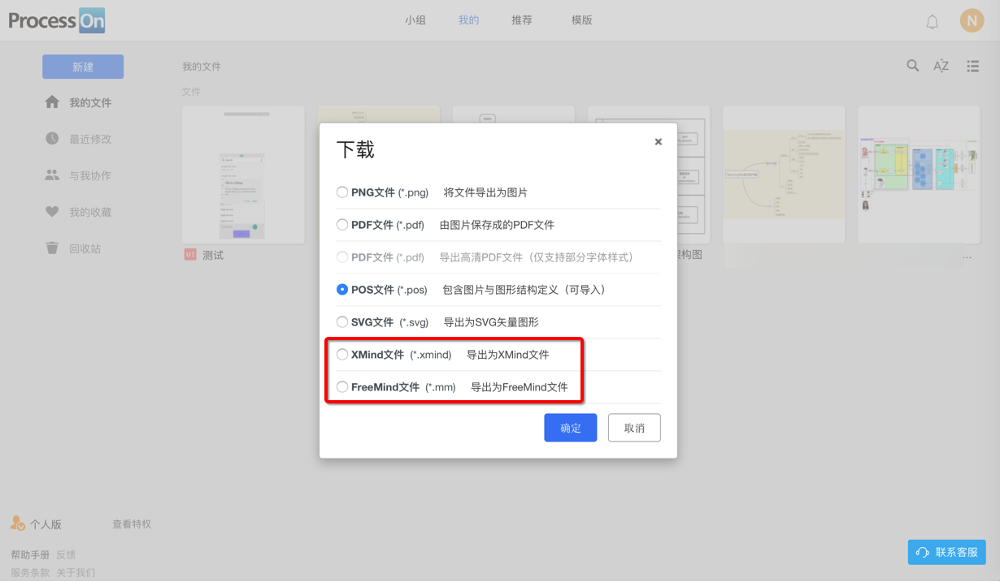

# ProcessOn

* `ProcessOn`
  * 概述：一个在线网站，可以用来画图，支持各种格式，功能强大且易用
  * 主页
    * ProcessOn - 免费在线作图，思维导图，流程图，实时协作
      * https://www.processon.com/
          * 
  * 特点
    * 各种类型的图
      * 思维导图=脑图
        * 
          * 可切换成 思维笔记
            * 
      * 流程图
        * 
    * 多种图形库 = 图形库很丰富
      * 
    * 支持团队协作
      * 
    * 海量模板库
      * 
    * （由于本身是网页版，所以）跨终端=支持多平台
      * 
  * 教程
    * ProcessOn - 帮助手册
      * https://www.processon.com/support
        * 
        * 

## 其他说明

### 使用技巧

* `Ctrl+拖动`：可以等比例缩放
* `Ctrl+Enter`：保存文本

### 导出格式丰富

要夸一句，最新 20180601 发现，processon，导出格式都开始支持，其（竞争对手的）`xmind`和`freemind`了：

-> 从这点上说，processon产品做的足够好，有足够自信，大家会愿意继续使用该产品

-> 而不怕别人导出为其他软件的格式，而不继续使用processon自己的产品

-> 有态度，有信心，有格局，赞一个。

注：只有脑图，可以导出（脑图的其他竞品的格式）`xmind`和`freemind`。其他非脑图，当然无法导出`xmind`和`freemind`。

