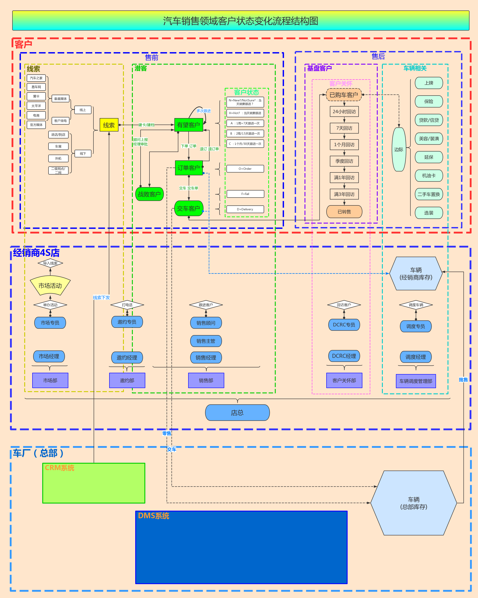

# processon举例

TODO：

* 把自己的processon中其他的图，也都作为例子放过来

## 画汽车销售领域客户状态变化流程图

### 最终效果

* 本地=离线=图片
  * 
* 在线=网页
  * 汽车销售领域客户状态变化流程结构图 | ProcessOn免费在线作图,在线流程图,在线思维导图
    * https://www.processon.com/view/link/5a604c7ae4b0a447b9adda93

### 画图过程

新建文件：

未命名文件：

然后就是，从左边拖动元素，到画布中，一点点编辑了。

期间的效果：

导航=缩略图预览：

以及可以用各种细节的功能：

调整文本颜色：

对齐方式：

填充样式：

线条颜色：

线条宽度：

线条样式：

连线类型：

线条的起始和终点的样式：

编辑对象：

布局调整：

图形对齐：

图形分布：

匹配大小：

格式刷：

右边的导航栏：

导航：

图形：

度量：

数据属性：

页面属性：

页面属性-》页面大小 自定义：

历史版本：

评论：

### 画完图后

#### 下载=导出文件

导出图片：

支持多种格式：

* 图片
  * png
  * jpg
  * svg
* 文件
  * pdf

下载格式：

下载到的多种格式的文件：

#### 群协作

#### 分享

点击分享，会生成链接：

即可在线页面查看：

汽车销售领域客户状态变化流程结构图 | ProcessOn免费在线作图,在线流程图,在线思维导图

https://www.processon.com/view/link/5a604c7ae4b0a447b9adda93

#### 发布

也可以根据需要去发布：

